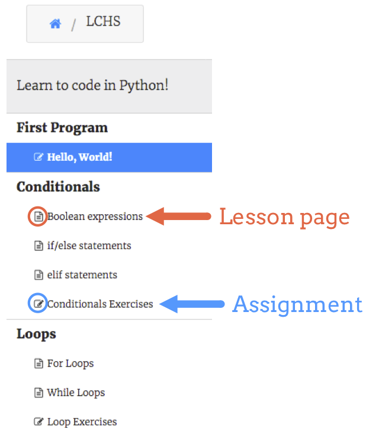
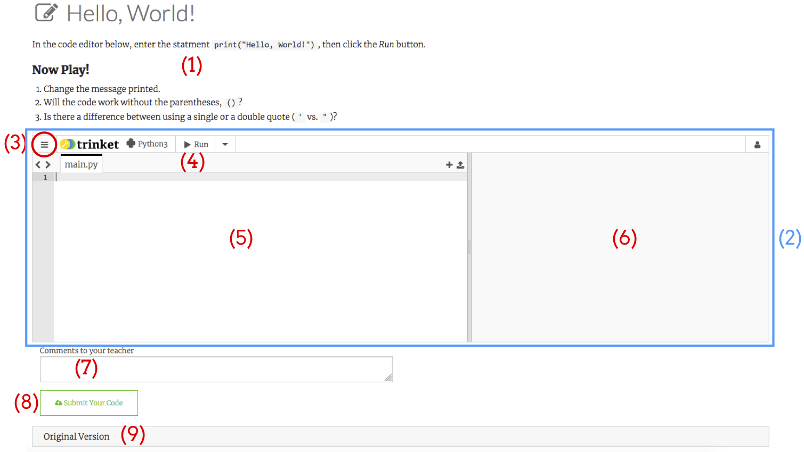

Trinket Courses
===============

A Trinket *course* provides students with the ability to create code and then
submit it to their teachers. It also allows teachers to post instructions,
track their students' work, and provide feedback.

Assignments can only be accessed by people enrolled in the course, and student
work can only be seen by the instructors.

A course is used to:

#. Create a learning space where teachers can post lessons, practice exercises,
   and assignments.
#. Organize coding tasks,
#. Complete and submit practice tasks and assignments,
#. Provide feedback for working or non-working code.

.. _trinket-course-assignments:

Homepage and Course Dashboard
-----------------------------

To access a course you have joined, login to your account to bring up your home
screen. (If you are already logged in, click the *Home* button in the top menu
bar).

Courses available to you are listed under the ``My Courses`` title.

.. figure:: figures/trinket-homepage.png
   :alt: Screenshot of Trinket home page.
   :width: 70%

   Trinket home page.

Clicking on a course name brings up dashboard where you can access a list of
assignments and projects your teacher has prepared for you.

   An outline of assignments waiting for your attention!

Clicking a title in the left hand menu opens it up the workspace.

Trinket Assignment Workspace
----------------------------

   The Trinket assignment workspace.

Features to note:

#. **Instructions**: Directions provided by your teacher. READ CAREFULLY!
#. **Active code editor**: This is the business part of the assignment! Some
   assignments may include multiple editors, and your work here will be turned
   in to your teacher.
#. **Settings menu**: Allows you to change settings like font size, or reset
   your code back to the original starting point.
#. **Run button**: Runs any code in the editor panel (X).
#. **Editor panel**: Type your code here.
#. **Console output**: After clicking the run button (Y), your program's output
   and any error messages show up here.
#. **Comment box**: Send a note to your teacher! :-)
#. **Submit button**:

   a. Turns in your work.
   b. Your teacher will be able to review your code and give you feedback.

#. **Original Version**: Opens a window showing the original starter code.

.. admonition:: Note

   Work done in a course will NOT appear in your *My Trinkets* area of your
   main account.
