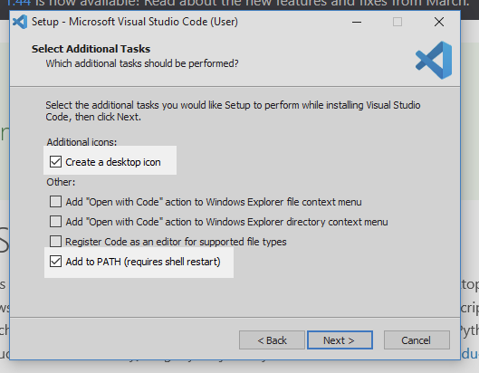

.. _vsc-install:

Setting Up Visual Studio Code
=============================

.. index:: IDE, integrated development environment, Visual Studio Code

Before we start coding on our computer, we need to make sure we have the right
tools! Programmers use **integrated development environments** (IDE) to write
and run their code.

**Visual Studio Code** is a code editor created by Microsoft. We will use it
throughout the course.

.. admonition:: Note

   Visual Studio Code is very customizable. Once you have everything set up,
   you can take additional steps to personalize your workspace such as changing
   the theme.

Follow the instructions below to install VS Code on your device.

#. :ref:`Windows <vscode-win-install>`
#. :ref:`Mac <vscode-mac-install>`
#. :ref:`Chromebook <vscode-chrome-install>`
#. :ref:`Adding Extensions <vscode-extensions>`

.. _vscode-win-install:

Windows Users
-------------

Visit the VS Code `website <https://code.visualstudio.com/>`__ and download the
Windows installer. (If the *Download for Windows* message is not displayed on
the large button, select the *Stable* Windows package using the dropdown
arrow).

After the installer fully downloads, run it. On the *Select Additional Tasks*
screen, be sure to select both *Create a desktop icon* and *Add to PATH*.

   The Select Additional Tasks panel.

Once the installation finishes, we need to open the application and perform a
few more steps.

.. _term-gitbash:

Configure VS Code to Use Git Bash
^^^^^^^^^^^^^^^^^^^^^^^^^^^^^^^^^

Let’s configure VS Code to use :ref:`Git Bash <terminal-setup>` instead of other
Windows terminal programs like PowerShell:

#. Open VS Code.
#. Open the Terminal menu from the top of the app and select *New Terminal*.
   
   .. figure:: figures/terminal-menu.png
      :alt: Open the Terminal menu and select 'New Terminal'.
      :width: 70%

      Open the terminal panel.

#. A new pane opens at the bottom of the application window. This is a terminal
   window. From the small dropdown found in this pane, choose *Select Default
   Shell*.
   
   .. figure:: figures/default-shell.png
      :alt: Choose 'Select Default Shell' from the terminal panel drop down menu.

      Find the dropdown menu in the toolbar of the terminal panel.

#. This will open a tool called the *Command Palette* at the top-center of the
   application window. Type *Git Bash* into the Command Palette and hit
   *Enter*.
   
   .. figure:: figures/command-palette.png
      :alt: Type 'Git Bash' in the command palette.
      :width: 70%

      Type ``Git Bash`` in the command palette.

#. Close VS Code and reopen it. Open a Terminal panel again from the menu.
   Verify that you see ``bash`` in the dropdown menu in the terminal pane.

   .. figure:: figures/bash-dropdown.png
      :alt: 'bash' is indicated in the terminal dropdown menu.

      The terminal dropdown bar displays ``bash``.

Now every time you open the terminal, it will default to Git Bash!

To finish setting up VS Code, complete the steps in the
:ref:`Adding Extensions <vscode-extensions>` section below.

.. _vscode-mac-install:

Mac Users
---------

#. Visit the VS Code `website <https://code.visualstudio.com/>`__ and download
   the Mac installer. (If the *Download for Mac* message is not displayed on
   the large button, select the *Stable* macOS package using the dropdown
   arrow).
#. Double-click the downloaded file and follow the installer instructions (the
   default selections are all fine). If there is an option to set the PATH
   environment variable, select it.
#. Find VS Code in the *Applications* folder and open the program. Once VS Code
   is running, right-click on its icon in the dock and select
   *Options > Keep in Dock*. We’ll be using VS Code quite a bit, and this will
   keep it handy.
#. Open the Terminal menu from the top of the app and select *New Terminal*.

   .. figure:: figures/terminal-menu.png
      :alt: Open the Terminal menu and select 'New Terminal'.
      :width: 70%

      Open the terminal panel.

#. Verify that you see ``bash`` in the dropdown menu in the terminal pane.

   .. figure:: figures/bash-dropdown.png
      :alt: 'bash' is indicated in the terminal dropdown menu.

      The terminal dropdown bar displays ``bash``.

   If ``bash`` does not appear, follow steps 3-5 in the
   :ref:`Configure VS Code <term-gitbash>` section above.

#. To finish setting up VS Code, complete the steps in the
   :ref:`Adding Extensions <vscode-extensions>` section below.

.. _vscode-chrome-install:

Chromebook Users
----------------

These instructions assume that you have already activated the
:ref:`Linux terminal <terminal-setup>` on your device.

#. Visit the VS Code `download page <https://code.visualstudio.com/download>`__.
#. Click on the ``.deb`` option under the Linux penguin.

   .. figure:: figures/download-vscode-chrome.png
      :alt: The .deb button appears below the Linux penguin logo.
      :width: 70%

      Select the ``.deb`` download option.

#. IMPORTANT: Locate the installation package in the *Downloads* folder. Drag
   it into the *Linux files* folder.

   .. figure:: figures/linux-files.png
      :alt: Drag and drop the downloaded installer into the 'Linux files' folder.
      :width: 50%

      Drag and drop the installer into the ``Linux files`` folder.

#. Open the *Linux files* folder. Double-click on the installation package to
   run it. Confirm the action, then wait. Accept all of the default options.

   .. figure:: figures/chrome-install-launch.png
      :alt: Confirmation window for installing VS Code.
      :width: 50%

      Run the installer!

#. Once done, find Visual Studio Code under the dock, inside the *Linux apps*
   subfolder. Click on the icon to launch the program.
#. Open the Terminal menu from the top of the app and select *New Terminal*.

   .. figure:: figures/terminal-menu.png
      :alt: Open the Terminal menu and select 'New Terminal'.
      :width: 70%

      Open the terminal panel.

#. Verify that you see ``bash`` in the dropdown menu in the terminal pane.

   .. figure:: figures/bash-dropdown.png
      :alt: 'bash' is indicated in the terminal dropdown menu.

      The terminal dropdown bar displays ``bash``.

   If ``bash`` does not appear, follow steps 3-5 in the
   :ref:`Configure VS Code <term-gitbash>` section above.

#. To finish setting up VS Code, complete the steps in the
   :ref:`Adding Extensions <vscode-extensions>` section below.

.. _vscode-extensions:

Adding Extensions
-----------------

Now that Visual Studio Code is up and running, we need to install some
*extensions*. These are small programs that support our work by highlighting
keywords, flagging syntax errors, providing suggestions, etc. We used these
features in the repl.it and Trinket online editors. Now we want to include them
in our VS Code workspace.

#. Open VS Code and select the *Extensions* icon on the left side of the
   workspace.

   .. figure:: figures/extensions-icon.png
      :alt: Extensions button in the VS Code toolbar.

      Extensions add helpful tools to VS Code!

#. In the search bar, enter ``Python``. Select the *Python* extension from
   ``Microsoft``. Click the *Install* button.

   .. figure:: figures/python-ext.png
      :alt: Python extension for VS Code.
      :width: 70%

      This extension allows VS Code to recognize and run Python code.

#. Back in the search bar, enter ``html css support``. Select and install the
   option from ``ecmel``.

   .. figure:: figures/html-css-ext.png
      :alt: HTML/CSS extension for VS Code.
      :width: 70%

      This extension allows VS Code to recognize HTML and CSS code.

Optional Extensions
^^^^^^^^^^^^^^^^^^^

Besides writing and running code, IDEs also provide support for coders! This
includes being able to preview a web page right inside the workspace or
providing suggestions for how to complete code statements.

While not necessary, the following extensions help you work:

#. Visual Studio IntelliCode by ``Microsoft``.

   .. figure:: figures/intellicode.png
      :alt: Intellicode extension for VS Code.
      :width: 70%

      This extension provides suggestions for completing code statements.

#. Close HTML/XML tag by ``Compulim``.

   .. figure:: figures/close-tags.png
      :alt: Close HTML/XML extension for VS Code.
      :width: 70%

      This extension automatically adds closing tags as you write HTML code.

There are LOTS of other extensions available. Feel free to explore the options!
