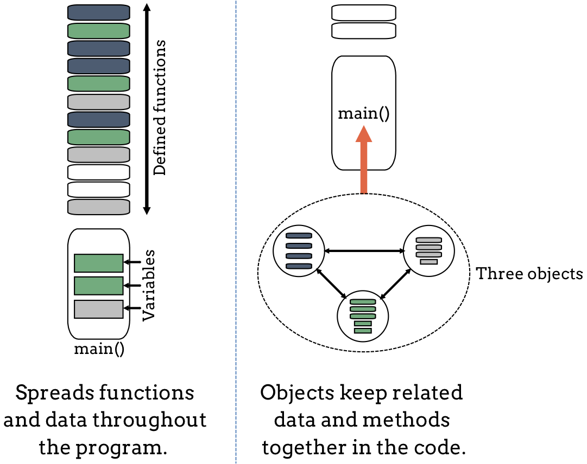

Why Use Objects?
================

Most of the Python programs you have written so far contain statements that
gather data, do something with it, and then display the results. You included
functions to help streamline your code, and you called those functions as you
needed them. This style of programming focuses on the process of working with
data:

#. Define or import a function to do a specific job,
#. Call that function and send it some data,
#. Do something with the returned result.

This style of programming works fine for small programs. However, as our
applications get bigger, reading, debugging and updating the code gets harder.

A Shift in Thinking
-------------------

An *object* wraps the processes of collecting and using data into one tidy
package. A single object can store data, perform actions on that data, and
return the results of those actions. Instead of defining several related
functions and variables at different places in our code, we can collect all of
those statements into a single object.

If we bring together a collection of different objects, each with its own
set of properties and methods, then we can build programs in a much more
flexible way. Each object controls its own data and actions. This lets us break
large programs into smaller and easier to control chunks.

Imagine that we write a program over several weeks or months. As we build it
and add new features, we code new functions and add them to the end of a
growing list. As long as we include the proper control statements and variables
in ``main()``, our program will work fine. However, as our code grows, it will
get more difficult to keep track of how each function relates to the data and
the actions performed in ``main()``. In the figure below, our program might
look like the image shown on the left (shapes with the same color relate to
each other).

   Objects allow us to keep related code together in a program.

The right hand side of the figure shows the same program. However, this time we
created three objects in ``main()``. Inside each object, we placed data and
actions that relate to each other.

If we test our program and find a logic error with collecting and evaluating
user input, then the object-oriented approach helps us narrow down the
statements we need to check. We can focus on the object that deals with that
task instead of having to search through all of our code to find the faulty
``input`` statements and/or function calls.

Using objects sounds similar to what we did in the
:ref:`Modules chapter <modules-index>`. However, unlike the external module
files, objects get created as they are needed and only *when the program runs*.

Picture How Objects Work
------------------------

As we shift our thinking towards using objects, it helps to create a mental
picture that connects how we want to code with sone real life examples. In the
world around us, we interact with objects all the time, like cars, phones, pets,
and our friends.

Lorem ipsum... (drive box).

Phones as Objects
^^^^^^^^^^^^^^^^^

Take a look at the following code syntax:

.. sourcecode:: Python
   :linenos:

   show_weather(phone)

   phone.weather()

Line 1 shows a function call to ``show_weather``, and we pass it ``phone`` as
the argument. The statement tells Python, *Run the code to give us a weather
report, and use the data assigned to phone*.

Line 3 shows an object-oriented approach to the same job. ``phone`` is an
object that contains code for displaying the weather. The statement tells
Python, *Make the phone object run its weather() code*.

Cooking with Objects
^^^^^^^^^^^^^^^^^^^^

If we stand in a kitchen, we will probably find several different tools for
cooking dinner. These might include a microwave, a stove top, an oven, a
crockpot, and maybe a barbecue grill (although we should move that outside
RIGHT NOW). What we won't find in the kitchen is a device called ``cook()``.

Each tool (stove, oven, microwave, etc.) has its own ``.cook()`` method
designed to work with its hardware. To warm up our food, we put it in one
device and then push a button or turn a dial. We do NOT place the tool and our
food into a defined corner and say *Use this device to warm up this food*.

.. todo:: Insert figure here! (``.cook()`` method for kitchen appliances).

Check Your Understanding
------------------------

.. admonition:: Question

   Which of the following refers to the *properties* of an object?

   .. raw:: html

      <ol type="a">
         <li><input type="radio" name="Q1" autocomplete="off" onclick="evaluateMC(name, false)"> behaviors of the object</li>
         <li><input type="radio" name="Q1" autocomplete="off" onclick="evaluateMC(name, false)"> actions the object can take</li>
         <li><input type="radio" name="Q1" autocomplete="off" onclick="evaluateMC(name, true)"> data describing the object</li>
      </ol>
      

.. Answer = c

.. raw:: html

   
