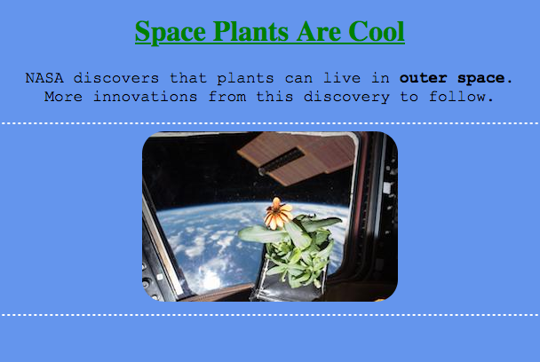

CSS Properties
==============

Below are some examples of common CSS properties and what they do. This is by
no means a complete list, but it is a good place to start.

Good CSS Properties to Know
---------------------------

.. list-table::
   :widths: auto
   :header-rows: 1

   * - CSS Property
     - Definition
     - Default Value
   * - ``background-color``
     - Sets the color of the background for an element.
     - transparent
   * - ``border``
     - Takes 3 values for the border (width, style, color).
       
       - Only the ``style`` value is required.
       - ``width`` sets the thickness of the border around an element.
       - ``style`` values include solid, wavy, dotted, dashed, and double.

     - medium (3px), none, text color
   * - ``border-radius``
     - Rounds the 4 corners of an element.
     - 0px
   * - ``color``
     - Changes the text color.
     - black
   * - ``font-family``
     - Changes the font types.
     - Depends on the browser
   * - ``font-size``
     - Changes the size of the font.
     - medium or 20px
   * - ``text-align``
     - Aligns the text within an element.
     - left
   * - ``text-decoration``
     - Applies decorations to text and takes 3 values (line, color, and style).
       
       - Only the ``line`` value is required.
       - ``line`` values include underline, overline, and line-through. 
       - ``style`` values include solid, wavy, dotted, dashed, and double.

     - no line, text color, solid

A larger, searchable list of CSS properties can be found at
`W3Schools <https://www.w3schools.com/cssref/>`__.

CSS Example
-----------

Adding CSS to the HTML page about Space Plants is the logical next step in building a website about this cool discovery.
The astronauts building the site used the ``body``, ``h1``, and ``p`` selectors to change some of the styling of those elements.

.. sourcecode:: html
   :linenos:

   <!DOCTYPE html>
   <html>
      <head>
         <title>Plant-Loving Astronauts</title>
            
      </head>
      <body>
         <h1>Space Plants Are Cool</h1>
         
NASA discovers that plants can live in <b>outer space</b>. More innovations from this discovery to follow.

         
         <!-- This image was taken by NASA and is in the Public Domain -->
      </body>
    </html>

Modify code and screenshot to include more properties from the list above...

Check Your Understanding
------------------------

.. admonition:: Question

   Find a CSS property and give its name, definition, and default value. Please
   do NOT use one of the ones above.
