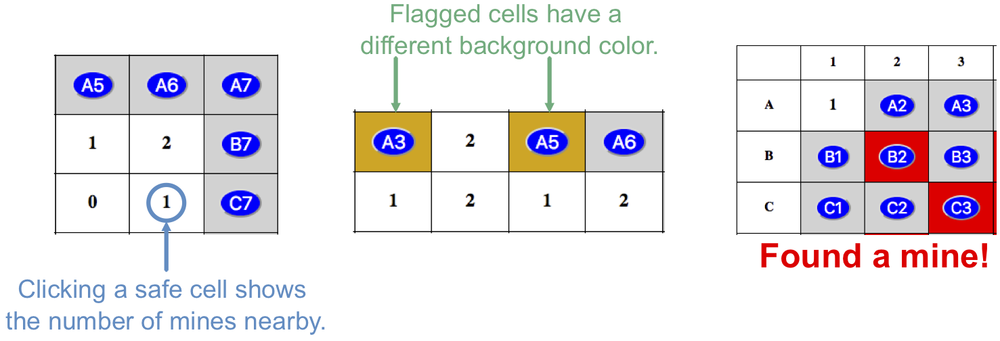

Database Functions
==================

When a player clicks a cell on the game board, several things might happen:

#. If the cell contains a mine, the game ends. The player blows up, all of the
   hidden mines are revealed, and any remaining buttons are deactivated.
#. If the cell does NOT contain a mine, the button is replaced by a number.
   This number tells the player how many mines are located in the spaces
   surrounding the cell.
#. If the *Flag Mine* checkbox is selected, the cell changes color when
   clicked. The button remains active.

   Selected cells, flagged cells, and mined cells all show different background colors.

Our goal over the next two pages will be to get all of these behaviors working.
We'll start with the required database operations.

Add Code To ``crud.py``
-----------------------

One of the central actions in the game is to display the number of mines
around a clicked cell. This data needs to be known *before* the player makes
their the first move. Let's figure out how to gather the mine information and
store it in the database.

Open the ``crud.py`` file in Visual Studio Code, then code along with the
video:

.. todo:: Insert video tutorial for adding the Minesweeper CRUD logic.

Note counter in record_mines. This works for now, since the list of mine coords
is sorted, and the rows are added to the mine table in order. However, if we
wanted to link these two tables, or if the mines were added to existing
content, we would need to add extra steps to match the mine_id values in the
separate tables.

Video Summary
-------------

#. Import required modules.
#. Review the execute_query() function.
#. Code record_mines() and count_mines() functions.
#. Code the check_surroundings() function. Note the *nested* loops for the
   systematic row and column checks.
