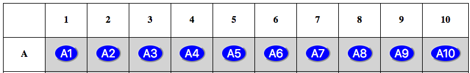

Gameplay Functions Review (Optional)
====================================

When you first cloned the Minesweeper project from GitHub, the repository
included several complete functions. The video tutorials in the chapter mention
these functions, but they skip a detailed analysis of the code. Well, now is a
good time to take a deeper look!

This page describes how the ready-made functions work. However, the code shows
ONE way to solve the gameplay tasks. There are many OTHER ways to achieve the
same results. Feel free to create a new branch in your Git repository and
experiment with your own ideas. You can try to streamline the functions, or
replace any of them with a completely new set of statements. Remember, we learn
to code by *coding*, and this includes examining other programmers' work.

The ``game_logic.py`` Module
----------------------------

This file manages the nitty-gritty details of running Minesweeper. It resets
the conditions for each new game, initializes session variables, populates
lists, hides mines, formats SQL query strings, and checks if the player makes a
safe choice on the board.

The module begins by importing *other* Python modules:

.. sourcecode:: Python
   :linenos:

   import random
   import string
   from crud import *

``random`` is used to choose where to hide the mines. ``string`` helps build
the row labels and cell coordinates. The functions from ``crud`` run the SQL
queries.

Now let's examine four of the functions included in ``game_logic.py``.

The ``make_columns()`` Function
^^^^^^^^^^^^^^^^^^^^^^^^^^^^^^^

``make_columns()`` is the shortest function in the module. It's job is to
fill a list with the column headings for the game board. It is called from the
``reset_board()`` function.

   The game board has 11 columns, numbered 1 - 10. The first column doesn't
   contain a heading.

.. sourcecode:: Python
   :lineno-start: 20

   def make_columns():
      headings = ['']
      for label in range(10):
         headings.append(label+1)
      return headings.copy()

Here's a breakdown of the code:

#. **Line 21**: Instead of an empty list, ``headings`` begins with a single
   entry. That string value keeps the upper left cell on the board blank. Since
   the first column contains row letters instead of active spaces, no heading
   is necessary.
#. **Line 22**: This sets up a basic ``for`` loop. Each time it repeats,
   ``label`` is assigned a new integer (0, 1, 2, ..., 9).
#. **Line 23**: This appends the value ``label + 1`` to the end of the
   ``headings`` list.
#. **Line 24**: This returns an independent copy of the column headings, which
   is assigned to ``session['columns']``.

.. admonition:: Note

   Since the loop just builds a list of 10 numbers, you might wonder why we
   don't hard-code the result.

   .. sourcecode:: Python

      headings = ['', 1, 2, 3, 4, 5, 6, 7, 8, 9, 10]
   
   Well, if we add a parameter to ``make_columns()`` we can adapt the ``for``
   loop to generate a different number of headings for the game board. This
   opens up the possibility for different board layouts.

   .. sourcecode:: Python

      def make_columns(num_headings = 10):
         headings = ['']
         for label in range(num_headings):

The ``make_rows()`` Function
^^^^^^^^^^^^^^^^^^^^^^^^^^^^

Lorem ipsum...

The ``place_mines()`` Function
^^^^^^^^^^^^^^^^^^^^^^^^^^^^^^

Lorem ipsum...

The ``check_guess()`` Function
^^^^^^^^^^^^^^^^^^^^^^^^^^^^^^

Lorem ipsum...

The ``check_guess()`` function returns ``True`` each time the user clicks on a
safe cell on the game board. This happens when the cell does NOT contain a
mine, or if the user selects the *Flag Mine* option before clicking on the
cell. ``check_guess()`` returns ``False`` when the player chooses a cell that
contains a mine.

The ``crud.py`` Module
----------------------

Lorem ipsum...

The ``check_surroundings()`` Function
^^^^^^^^^^^^^^^^^^^^^^^^^^^^^^^^^^^^^

Discuss the check_surroundings() function. Note the *nested* loops for the
systematic row and column checks.
