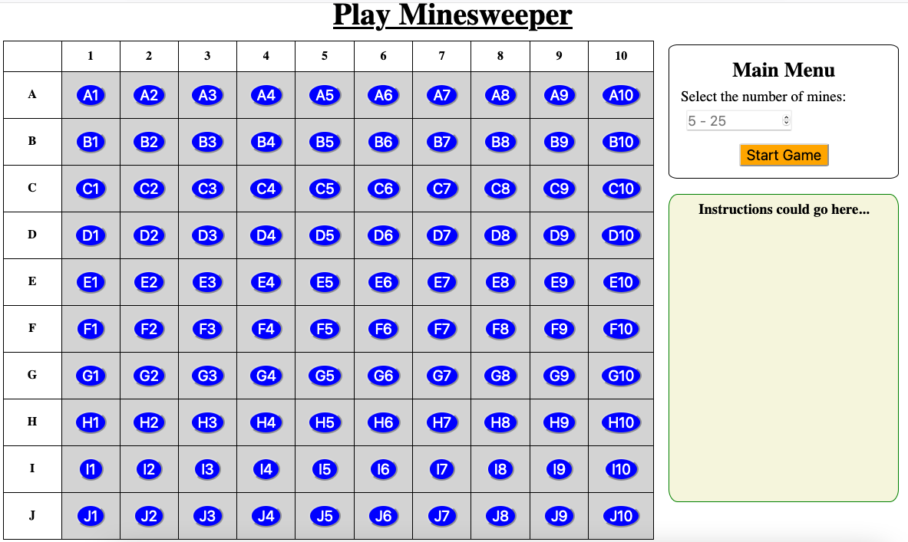

Create the Home Page
====================

The Minesweeper game uses two different webpages: a home screen plus an active
playing space. We need to build an HTML template for each page.

Review ``base.html``
--------------------

Since both game pages use the same ``<head>`` element, we can put that common
code into a base template:

.. admonition:: Example

   Open ``base.html`` file to find this code:

   .. sourcecode:: HTML
      :linenos:

      <!DOCTYPE html>
      <html lang="en">
      <head>
         <head>
            <meta charset="UTF-8">
            <meta name="viewport" content="width=device-width">
            <title>LCHS Minesweeper</title>
            <link rel="stylesheet" type="text/css"
               href="{{ url_for('static', filename='style.css') }}">
         </head>
      </head>
      <body>
         <h1>{{page_title}}</h1>
         
         
      </body>
      </html>

Note the following:

#. We link to a ``style.css`` file in line 8. It contains some basic styling
   rules for the game, and the tutorials won't instruct you to change any of
   the settings. However, you absolutely CAN adjust the properties and values
   as you see fit! Don't like the gray background on the board? Fix it!
#. On line 13, the placeholder for the page title needs to be filled. Don't
   forget to pass a value to ``page_title`` from each ``render_template()``
   function.
#. Feel free to add extra elements to ``base.html``. Remember that this
   content will appear on any template that extends from the base.

Build ``index.html``
--------------------

The home screen for the game presents users with an inactive copy of the board,
a menu for choosing the number of mines, and a space for instructions.

   The LCHS Minesweeper home page.

Remember that our goal is to get the game working, so we will keep this page
simple for now. We can always make improvements and add other features later!

Follow along with the video as we build the HTML template:

.. todo:: Add video tutorial for creating the home page for the Minesweeper game.

Video Summary
-------------

#. Creating the table with Jinja3 loops.
#. Note make_columns() and make_rows() functions in the game_logic.py file.
   (We will use these to fill in r/c headings as well as the text inside the
   game board buttons).
#. Add code to main.py to render the template.
#. On the home-logic page, we will add statements to deal with placing mines,
   collecting user input, etc.
