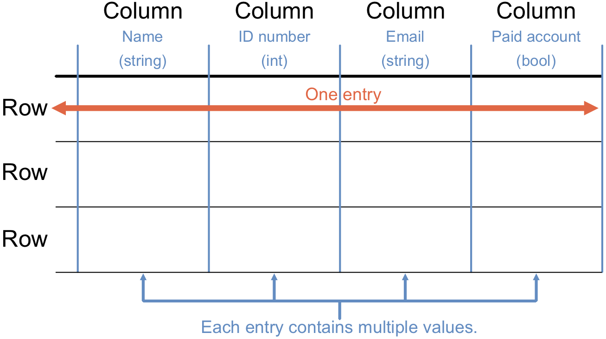

Database Structure
==================

Databases store information in **tables**. These are arranged in *columns* and
*rows*. Each column represents a specific piece of data. Every row represents
a single entry in the table.

   Each row is one entry. Each entry consists of multiple data values, arranged in columns.

**Points to note**:

#. Each column holds a particular data type, like integers, strings, lists,
   etc. All values in a column must be the same data type.
#. Each column also has a label that tells us what the data represents. For
   example, one column might have a ``Last Name`` label, while another could be
   called ``Email``.
#. Each row includes a unique *key*, which helps us manage the data.
#. When we *add or remove* an entry, we create or delete an entire row.
#. When we *change* an entry, we modify the value in one or more columns of a
   single row.

The number of entries in a table is equal to the number of rows. The number of
data values for each entry matches the number of columns.

Relationships Between Tables
----------------------------

**Relational databases** store data in tables, which are connected to each
other in a variety of different ways. Relational databases provide
flexibility for both expansion of the database and modification of the
relationships between the tables as things change.

Diagram of table relationship (e.g. author info vs. book info)...

Instead of duplicating entires, add relationships between tables. This way, we
can retrieve the information we want by following the links between the tables.
"Oh, you want the author's b-day, but the book table doesn't have it. Well,
let me follow this link from 'Author' column in the book table to that same
person in the 'authors' table."
