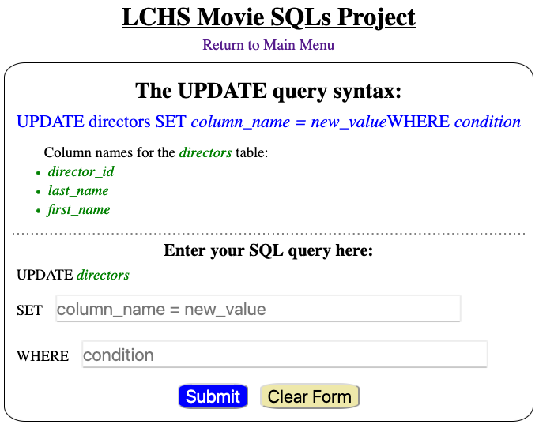

Project: Movie SQLs
===================

In this chapter, we assigned different string values to a ``sql_query``
variable and used that to execute SQL commands. For the short practice
examples, this worked well. However, we do need a better way to create and run
our queries. After all, we don't want to rewrite our code every time we need to
interact with the database!

In this project, you will use input from a web form to build ``sql_query``
strings. These queries will work on two tables stored in a database: ``movies``
and ``directors``.

The database and the HTML templates are ready to go, but the application is
incomplete. Your job is to fill in the gaps to successfully collect and execute
SQL queries. You will also get to review your HTML, CSS, and Flask skills!

Project Setup
-------------

#. Open your ``local_practice`` directory in Visual Studio Code. Clone a copy
   of the starter code from this `GitHub repository <https://github.com/LaunchCodeEducation/LCHS_movie_sql_project>`__.
#. Use the *File* menu to open ``LCHS_movie_sql_project``.
#. Follow the usual procedure to create a new virtual environment, activate it,
   and install Flask. If you need a reminder for how to do this, the ``README``
   file contains a summary of the process.
#. Add the name of your virtual environment to the ``.gitignore`` file.
#. The project file tree should now look something like the figure below. If
   you gave a different name to your virtual environment, it will appear
   instead of ``movie-env``.

   .. figure:: figures/db-project-tree-start.png
      :alt: File tree showing 4 folders, 6 templates, main.py, style.css, .gitignore, and a README file.

      For this project, you will work with ``main.py``, six template files, and ``style.css``.

#. Run ``main.py`` to check that everything is OK so far. The application opens
   to a home page:

   .. figure:: figures/db-project-home.png
      :alt: The index.html page, showing a form to select the type of SQL query.
      :width: 70%

      The form lets users select the type of SQL query and the table to access.

#. Use ``git status/git add ./git commit -m`` to begin a version control
   record. If you have your own GitHub account, take a moment to push the
   repository up to the site.

The application runs, but it doesn't generate SQL queries yet. Let's take a
moment to explore what works so far.

The Home Page (``index.html``)
^^^^^^^^^^^^^^^^^^^^^^^^^^^^^^

.. index:: ! gateway page

The main page for the application gives users four options to choose from, plus
a dropdown menu to select a table. ``index.html`` serves as a **gateway page**.
Its job is to direct users to different pages based on the selected CRUD
operation.

Select one of the options, pick a table, and then click *Submit*. You will be
redirected to a different page and web form. Do this for all four of the
options.

.. admonition:: Tip

   If you're curious about how the gateway page operates, check out the
   comments included with the ``index()`` function in ``main.py``.

   The ``index.html`` template also includes comments describing how the page
   is put together.

Each form is complete. However, none of them produce correct SQL strings yet,
because the functions controlling the pages need to be finished.

Your job is to fill in the missing pieces, starting with the easiest function.
Be sure to follow the recommended order! Each task asks you to do a little more
than the one that came before.

The DELETE Form
---------------

From the home page, select ``DELETE`` and the ``Movies`` table. This will
redirect you to a specific form.

.. figure:: figures/delete-form.png
   :alt: The DELETE form, with one input box for the WHERE condition.
   :width: 40%

   With the ``DELETE`` form, users submit a condition for the ``WHERE`` clause.

Try typing something into the input box, then submit the form. Nothing seems to
happen, because the ``delete_query()`` function in ``main.py`` is almost empty.
You need to add code to the function that will:

- Request data from the form.
- Build a correctly formatted ``sql_query`` string based on that input.
- Render the page again, but with the ``sql_query`` string displayed
  underneath the form.

  .. figure:: figures/delete-form-function.png
     :alt: The DELETE query form, with an input box where users can enter a WHERE condition.
     :width: 80%

     The ``delete_query()`` function in ``main.py`` should build a properly formatted SQL query.

#. Open ``main.py`` and add this code inside the ``delete_query()`` function.

   .. sourcecode:: Python
      :lineno-start: 44

      def delete_query():
         if request.method == 'POST':
            pass
         else:
            pass
         return render_template('delete.html', tab_title = 'DELETE query', home = False)

#. Next, add code to collect the ``condition`` text from the form. Also,
   collect the table name from the session cookie.

   .. sourcecode:: Python
      :lineno-start: 44

      def delete_query():
         if request.method == 'POST':
            condition = request.form['condition']
            table = session['table']
         else:
            pass

#. Use the ``table`` and ``condition`` variables to build the string for the
   SQL query. Also, assign the empty string to ``sql_query`` in the ``else``
   clause.

   .. sourcecode:: Python
      :lineno-start: 44

      def delete_query():
         if request.method == 'POST':
            condition = request.form['condition']
            table = session['table']
            sql_query = f"DELETE FROM {table} WHERE {condition}"
         else:
            sql_query = ''
            
#. Finally, use the ``render_template()`` function to pass ``sql_query`` to the
   ``delete.html`` template.

   .. sourcecode:: Python
      :lineno-start: 44

      def delete_query():
         if request.method == 'POST':
            condition = request.form['condition']
            table = session['table']
            sql_query = f"DELETE FROM {table} WHERE {condition}"
         else:
            sql_query = ''
         
         return render_template('delete.html', tab_title = 'DELETE query',
            home = False, sql_query = sql_query)

#. Save your changes. Run ``main.py`` and submit the form several times to
   check your code. Fix any bugs that occur.

Congratulations! The ``delete_query()`` function are now working. Be sure to
save, commit, and push your work.

.. admonition:: Note

   Right now, users can type whatever they want in the input box. Don't worry
   about this right now.

The UPDATE Form
---------------

From the home page, select ``UPDATE`` and the ``Directors`` table. When the new
page loads, notice that the form contains two input fields.

   With the ``UPDATE`` form, users submit text for both ``SET`` and ``WHERE``.

You want this form to behave in a similar way to ``DELETE``. Users will submit
TWO text fields, and the ``update_query()`` function will send back a completed
query string.

#. Open ``update.html`` and identify the name for each input element.

   .. sourcecode:: HTML
      :lineno-start: 21

      <h3>Enter your SQL query here:</h3>
      
UPDATE {{session['table']}}

      <label>SET <input class="query-input" name="new_value" type="text" placeholder="column_name = new_value" required/></label>
      <label>WHERE <input class="query-input" name="condition" type="text" placeholder="condition"/></label>
#. Open ``main.py`` and find the ``update_query()`` function. Add a basic
   ``if/else`` conditional.

   .. sourcecode:: Python
      :lineno-start: 40

      def update_query():
         if request.method == 'POST':
            pass
         else:
            sql_query = ''
         
         return render_template("update.html", tab_title = "UPDATE query", home = False)
#. Using the ``delete_query()`` function as a model, replace the ``pass``
   keyword. Collect data from the form and session, and assign those values to
   the variables ``table``, ``new_value``, and ``condition``.
#. Use the ``table`` and ``new_value`` variables to build the first part of the
   ``sql_query`` string:

   .. sourcecode:: Python

      sql_query = f"UPDATE {table} SET {new_value}"

#. For an ``UPDATE`` query, the ``WHERE`` clause is optional, so a user might
   not submit one. Add a conditional to deal with this case:

   .. sourcecode:: Python

      sql_query = f"UPDATE {table} SET {new_value}"
      if condition != '':
         sql_query += f" WHERE {condition}"
#. Finally, use the ``render_template()`` function to pass ``sql_query`` to the
   ``update.html`` template.
#. Save your changes and run the application to check your code.

.. figure:: figures/update-form-working.png
   :alt: A properly formatted SQL query string displayed below the UPDATE form.
   :width: 80%

   The ``update_query()`` function combines several pieces of data to complete a SQL query string.

The INSERT Form
---------------

You've done this twice now. Rinse and repeat to complete the ``insert_query()``
function.

The SELECT Form
---------------

Lucky you! The ``select_query()`` function already filled in. Take a moment to
examine how it is put together.

Create the Database
-------------------

Lorem ipsum...

Code the ``execute_query`` Function
-----------------------------------

Lorem ipsum...

Bonus
-----

Add CSS styling to make the form(s) look nice.

Old Notes
---------

The next chapter is an extended walkthrough. You will first add a database to a
Flask application. Then you will replace the hard-coded ``sql_query`` strings
in your Python program with ones built from your web form. You will also use
your Jinja2 template skills to display the results from ``SELECT`` queries.

Each page in the next chapter will add one piece to the Flask application. By
the end, you will have a user interface that runs in the browser. This provides
a more convenient way to add information to a selected table, perform searches,
update existing data, or delete entries.

Yes, the expectations are high. HOWEVER, it's also the end of the course. You
are TOTALLY ready for this challenge!

Let's get started.
