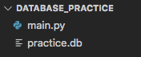

SQLite
======

For this course, we are not going to create or access a large-scale database.
Instead, we will mimic the behavior of a database by creating a file in our
project directory. This file will contain all the necessary tables, and we will
use it to store and access information.

.. index:: ! SQLite
   single: SQL; SQLite

The queries we use to execute database commands must be written in SQL. There
are different versions of SQL used across the coding community, but we will
focus on one called **SQLite** (pronounced *sequel light*). It provides a
smaller, less complicated introduction to working with databases.

Python comes with a module specifically designed around SQLite. Let's begin by
importing it and connecting to a practice database!

Setup
-----

#. Launch Visual Studio Code. From the *File* menu, open your
   ``local_practice`` directory.
#. Create a new folder called ``database_practice``. Make sure you keep it
   outside of any existing project or Git repository.
#. From the *File* menu, open ``database_practice``.
#. In the terminal, use ``git init`` to initialize the project as a new Git
   repository.
#. Create a ``main.py`` file and open it in the workspace.
#. On line 1, import the SQLite module:

   .. sourcecode:: Python
      :linenos:

      import sqlite3

``sqlite3`` contains all the methods and tools we need to create and maintain a
local database. 

That's it! We are now ready to dive into our first database!

Create a Database
-----------------

.. index:: ! connection object, ! cursor object
   single: SQLite; connection
   single: SQLite; cursor

To interact with a database, we must do three things inside our Python code:

#. Create the database.
#. Define a **connection object** that links our program to the database.
#. Define a **cursor object** that will execute our SQL commands.

In ``main.py``, add the following commands:

.. sourcecode:: Python
   :linenos:

   import sqlite3

   database = sqlite3.connect('practice.db')
   cursor = database.cursor()

Line 2 creates the ``database`` object and assigns it the properties and
methods we need to interact with our database.

The ``connect`` method links our program to the database called
``practice.db``. If this file does not exist in our project directory, Python
creates it for us.  (Thanks, Python!)

Line 3 defines the ``cursor`` object. We will use this object to run SQL
commands and perform CRUD operations.

.. admonition:: Note
   
   We can use any variable name we want for the connection object, but popular
   choices include ``conn``, ``connection``, ``database``, and ``db``.

   Similarly, we can name the cursor object whatever we want, as long as our
   choice follows proper Python naming conventions.

Go ahead and run ``main.py``. Notice that ``practice.db`` appears in the file
tree!

   We now have a database inside our project directory.

Opening ``practice.db`` in the workspace shows an empty file. This isn't
surprising, since we just created it. However, our database now exists and is
ready to receive some information.

.. admonition:: Tip
   
   Take a moment to save and commit your changes!

Add a New Table
---------------

The next step is to add a new table to our database. We will do this with the
``cursor`` object. ``cursor`` uses a special method to run SQL commands. The
general syntax is:

.. sourcecode:: Python

   cursor.execute(sql_query)

``sql_query`` must be a string or a string variable. What we put in that string
depends on the action we want to perform. When ``.execute()`` runs, it converts
the string into the SQL language and implements the command.

Let's use ``.execute()`` to create a table called ``students`` in
``practice.db``. The table will hold student names and their graduation year.

#. In ``main.py`` define a variable to hold the SQL command.

   .. sourcecode:: Python
      :linenos:

      import sqlite3

      database = sqlite3.connect('practice.db')
      cursor = database.cursor()

      sql_query = "CREATE TABLE students (last_name TEXT, first_name TEXT, grad_year INT)"

   Python and the SQL language use different names for some of the same data
   types. Notice that ``last_name`` and ``first_name`` are both set as ``TEXT``
   instead of ``str``.
   
   A deep dive into all the SQL data types is beyond the scope of this course.
   We focus on only a few, and we will pick them up as needed.
#. Once you assign the ``sql_query`` string, the next step is to make it
   happen! Add one more statement to ``main.py``, then save.

   .. sourcecode:: Python
      :lineno-start: 6

      sql_query = "CREATE TABLE students (last_name TEXT, first_name TEXT, grad_year INT)"

      cursor.execute(sql_query)

#. Run ``main.py``, aaannnnnddd... nothing seems to happen! However, as long as
   no error message appears, your code ran just fine. Checking the file tree
   shows that changes did take place in both ``main.py`` and ``practice.db``.

   .. figure:: figures/new-table.png
      :alt: File tree highlighting changes in main.py and practice.db after adding a table.

      The ``M`` indicates the files that were changed.

#. Open ``practice.db`` in the workspace. You might see a message telling you
   that VS Code cannot display the contents of the file.

   .. figure:: figures/view-db-1.png
      :alt: Message asking if we really want to open the .db file.
      :width: 80%

   Clicking *open it anyway* shows mostly unreadable text.

   .. figure:: figures/view-db-2.png
      :alt: Showing unreadable content that exists in the practice.db file.
      :width: 80%

      VS Code can't render a clean view of the database (yet).

#. While this doesn't seem useful at first, it DOES prove that the ``.execute``
   statement altered the ``practice.db`` file.

On the next page, we will install an extension in VS Code that will let us
view the contents of a database.

Table Creation Error
--------------------

If you haven't already done so, run ``main.py`` again. You will receive an
error message.

.. sourcecode:: bash

   Traceback (most recent call last):
   File "main.py", line 8, in <module>
      cursor.execute(sql_query)
   sqlite3.OperationalError: table students already exists

The last line tells us why the program crashed. The ``students`` table already
exists in the database. Running the ``CREATE TABLE`` command a second time does
NOT overwrite the original table. *This is a nice safety feature*. We want to
protect the database against accidental deletions. However, we also want to
rerun our code.

When we run our program, we want to create the ``students`` table if it isn't
in the database, but ignore the command if it is already present. Fortunately,
we can modify our ``sql_query`` string to deal with this.

.. admonition:: Try It!

   #. Update ``sql_query`` like this:

      .. sourcecode:: Python
         :lineno-start: 6

         sql_query = "CREATE TABLE IF NOT EXISTS students (last_name TEXT, first_name TEXT, grad_year INT)"

   
   #. The ``IF NOT EXISTS`` syntax operates in a similar way to the ``not in``
      keywords in Python.

      .. sourcecode:: Python

         'a' not in 'Rutabagas'  # Returns False, because 'a' is in 'Rutabagas'
         42 not in [10, 8, 5]    # Returns True, because the list is missing 42

   #. ``IF NOT EXISTS students`` checks to see if the database does NOT contain
      a table called ``students``. If ``True``, the table is added. If
      ``False`` the command is ignored.
   #. Run ``main.py`` again. You should not see an error message.

Be sure to save and commit your work before moving on!

Video Link
----------

SQLite3 in 5 minutes: https://youtu.be/girsuXz0yA8
