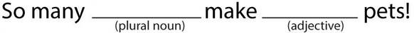
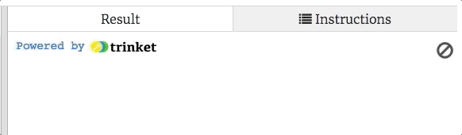

Exercises: Dictionaries
=======================

Let's use dictionaries to play Mad-Libs!

.. admonition:: Note

   If you are not familiar with Mad-Libs, you can learn about them
   `here <https://en.wikipedia.org/wiki/Mad_Libs#Format>`__, and then play a
   few `short samples <http://www.madlibs.com/>`__ with your friends.

Login to your Trinket.io account and make a copy of this
`starter code <https://trinket.io/python3/02b97686f1>`__.

Part 1: Mad-Lib Text
--------------------

First, you need to create a string that looks something like a Mad-Lib
statement.

   Mad-Lib sentence with labeled blanks.

Instead of blanks, you will use symbols to indicate the words a player needs
to provide. For example, if they need to give a verb for the sentence, ``"The
turtle ____ home,"`` your string might look like, ``"The turtle _verb1/ home."``

Note the ``_`` and ``/`` symbols on each side of the label ``verb1``. We will
use this notation to indicate where the player needs to fill in a blank.

#. In the starter code, find the ``main()`` function. Assign the ``mad_lib``
   variable a short Mad-Lib type sentence.
#. Your ``mad_lib`` text should contain two or three blanks where the player
   will need to suggest words. For example:

   ``"My _noun1/ colors are _color1/ and _color2/."``

   Here, the player would be asked to give one noun and two colors to complete
   the sentence.
#. For now, keep the text simple. You can use more complicated Mad-Lib strings
   later.

.. admonition:: Note

   You do not have to use ``_`` and ``/`` to mark the labels, but you should
   use a different symbol on each side. Just choose symbols that are NOT
   usually used in normal text.

   Examples:

   a. ``{noun1}``
   b. ``*noun1_``
   c. ``^noun1|``

Part 2: Build a Dictionary
--------------------------

Once you have your ``mad_lib`` string ready, the next statement in ``main()``
calls the ``create_madlib_dict`` function. The ``mad_lib`` string gets passed
in as the argument.

The ``create_madlib_dict`` function takes the labels from the string and turns
them into keys for a new dictionary. The function then returns that dictionary,
which gets assigned to the ``mlib_dict`` variable.

Code the ``create_madlib_dict`` function:

#. Line 1 defines the function and takes a string as a parameter. Line 2 splits
   the ``mlib_string`` into a list of words.
#. On line 3, print ``words`` to see what this list looks like (run the
   program). Note that the ``_`` and ``/`` symbols remain with the words we
   want the player to suggest.

   ::

      ['My', '_noun1/', 'colors', 'are', '_color1/', 'and', '_color2/.']
#. Replace the ``print`` statement with ``new_dict = {}``, to create an empty
   dictionary.
#. Now add a ``for`` loop. It should:

   a. Iterate through the ``words`` list.
   b. Check each word to see if it contains the underscore ``_`` symbol.
   c. If ``True``, take a *slice* from the word and assign it to a variable.
      The slice should NOT include the symbols or any punctuation. 

      .. sourcecode:: python

         key = word[1:word.find('/')] # Returns the characters between _ and /
   d. If ``True``, add a new key/value pair to ``new_dict``. Use ``key`` for
      the key, and use the empty string as the value.
   e. No ``else`` statement is required for the ``if``.

#. Print ``new_dict`` after the loop to check your progress. Properly done,
   it should look something like:

   ::

      {'noun1': '', 'color1': '', 'color2': ''}
#. Remove the ``print`` statement and return ``new_dict`` from the function.

Part 3: Query the User
----------------------

OK, now you're ready to ask the player for the fill-in-the-blank words.

The next statement in ``main()`` calls the ``prompt_user_for_words`` function
and sends ``mlib_dict`` as the argument. We want the function to prompt the
player for each of the words needed for the Mad-Lib.

The function should work something like this:

   Prompt the user to fill in the Mad-Lib blanks.

Part 4: Print the Result
------------------------

Duh.

Part 5: Enhance
---------------

Modify code to recognize capitalization (cap labels).

Part 6: Try Your Own
--------------------

Lorem ipsum...
