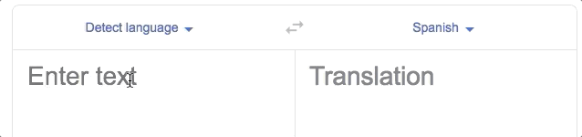

Code Like a Pirate!
===================

In this chapter, we have learned how to define a dictionary, add or modify the
key/value pairs, search through the keys and values, and loop through the
collection. However, we still need to understand what dictionaries allow us to
*do*.

Lists vs. Dictionaries
----------------------

First, neither collection is "better" than the other. There are some jobs
that lists solve more easily, while dictionaries provide the best choice for
other tasks. Lists and dictionaries are different, and this gives us two very
useful tools for solving problems.

The question isn't which collection is *better* than the other. The proper
question is which data structure best *fits the job at hand*.

Let's take a look at one task where having labeled values (key/value pairs)
really helps.

Translation App
---------------

Google has an easy to use algorithm that translates simple words and phrases
between languages.

   `Google translate <https://translate.google.com/>`__

While we cannot build something as complete as this app (yet), we CAN
understand how to make something similar with Python. At its core, the program
is built around a dictionary!

Take a look at this small English-to-Spanish dictionary, where the keys are
English words, and the values are the same words in Spanish:

.. sourcecode:: Python
   :linenos:

   eng_to_span = {
      'hello' : 'hola',
      'blue' : 'azul',
      'apple' : 'manzana',
      'python' : 'pitón',
      'fox' : 'zorro'
   }

Now imagine that a user inputs an English word. We could easily search the keys
in the ``eng_to_span`` dictionary. If we find the user's word, we can print the
value for that key, which is the Spanish translation.

That's it! Our word translator is limited only by the size and accuracy of the
dictionary.

.. admonition:: Try It!

   Add key/value pairs to the ``translate`` dictionary! Feel free to use words
   from any two languages you want, but you must be able to type in the starting
   words with the letters on your keyboard.

   #. The keys in the dictionary should be in the language that the user
      enters.
   #. The values will be in the other language.
   #. Use Google translate if you need help finding word pairs.

   .. raw:: html

      <iframe src="https://trinket.io/embed/python3/1aa8392d55" width="100%" height="500" frameborder="1" marginwidth="0" marginheight="0" allowfullscreen></iframe>

Walking through the code:

#. ``keep_going = True`` keeps the ``while`` loop running until the user tells
   the program to stop.
#. The ``word_to_change`` input statement prompts the user for the word to
   translate.
#. ``if word_to_change in translate`` checks to see if the entered word is one
   of the keys in the dictionary.

   a. If ``True``, then ``print(translate[word_to_change])`` displays the value
      for the key.
   b. If ``False``, then the user sees a message telling them that their word
      is missing from the dictionary.

#. The ``repeat`` input statement asks the user if they would like to keep
   going. Any entry that does NOT start with ``'y'``
   (``repeat[0].lower() != 'y'``) sets ``keep_going`` to ``False``, and the
   program ends.

Talk Like A Pirate
------------------

Lorem ipsum...

[INTERACTIVE REPL]

