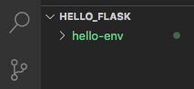

Install Flask
=============

Every new Flask project we create starts with the same basic steps. Follow the
instructions below to get set up for your first Flask web application.

Create a Project Directory
--------------------------

Every application we develop should have its own directory on our machine. This
allows us to initialize each one as its own Git repository.

#. On your device, create a new directory called ``flask_projects``. Inside
   this folder, create a sub-directory called ``hello_flask``.
#. Launch Visual Studio Code and open the ``hello_flask`` folder.
#. In the terminal pane, use the ``pwd`` command to verify that you are in
   ``hello_flask``.
#. Use ``git init`` to initialize a new repository.

Create a Virtual environment
----------------------------

.. index:: ! virtual environment

To run a Flask application, we must create a **virtual environment** inside the
project directory. Think of this like a collection of tools needed to make the
application run.

.. admonition:: Note

   We won't go into detail about *why* we need a virtual environment. For now,
   we just need to know *how* to set one up.

In the terminal, type the following command:

::

   Mac Users:
   $ python3 -m venv hello-env

   Windows Users:
   $ py -3 -m venv hello-env

``venv`` creates a new Virtual ENVironment. In this case, the environment is
called ``hello-env``.

Note that a ``hello-env`` folder appears in the project directory.

   The ``hello-env`` directory contains all of the tools needed to make our web application run in our browser.

Each Flask application we create will have its own virtual environment
directory.

Add Flask
---------

#. The next step is to *activate* the virtual environment. In the terminal,
   type the following command:

   ::

      Mac Users:
      $ . hello-env/bin/activate
      (hello-env) $

      Windows Users:
      $ hello-env/Scripts/activate
      (hello-env) $

#. ``(hello-env)`` now appears at the start of the terminal prompt. This
   indicates which virtual environment is currently active.
#. Now install Flask with the command:

   ::

      (hello-env) $ pip install Flask

#. Once the installation is done, check for success by using the command
   ``flask --version``.

   ::

      (hello-env) $ flask --version
      Python 3.8.3
      Flask 1.1.2
      Werkzeug 1.0.1

#. To exit an environment, just enter the command ``deactivate`` in the
   terminal.

Ready to Go
-----------

Lorem ipsum...
