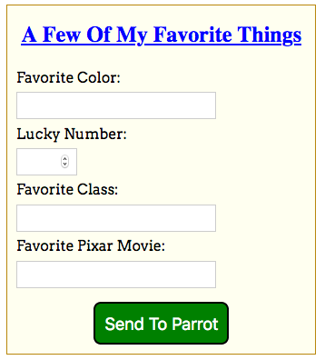

Styling Flask Templates
=======================

So far, we've used plain HTML for our sample form. However, in the
:ref:`last chapter <style-forms>`, we applied some CSS rules to spice up how
it looks.

   One option for a styled form.

For our web applications, we definitely want to link a stylesheet to our HTML
templates. To do this, we must save the ``.css`` file in a very specific place
within our project.

The ``static`` Directory
------------------------

By adding placeholders to our templates, we can change the content on a webpage
based on a user's actions. This makes the page *dynamic*. Style rules, on the
other hand, remain fixed. Our CSS code is an example of a *static* file. It
does not change as the user interacts with the page. Other examples of static
files include images, video clips, and JavaScript code.

In our Flask project, the ``templates`` folder holds all of the ``.html`` files
for our website. We need to create a similar directory for our static files.

#. In Visual Studio Code, use the terminal panel (or the buttons in the File
   Explorer pane) to create a new directory called ``static``. The folder
   should be at the same level as ``hello.py`` and ``templates``.

      [INSERT FILE TREE IMAGE HERE]

#. Inside the ``static`` folder, create a new file called ``style.css``.
#. Find the CSS code you used in the :ref:`last chapter <style-forms>` to
   style your form. Copy and paste that code into ``style.css``.
#. Save and commit your work.

Link to the Stylesheet
^^^^^^^^^^^^^^^^^^^^^^

When ``.html`` and ``.css`` files are in the same directory, the syntax for the
``<link>`` tag is:

.. sourcecode:: html

   <link rel="stylesheet" type="text/css" href="style.css">

Now that we've separated our HTML and CSS files, we need to update the ``href``
attribute. Instead of ``style.css``, we need to fill in a *path* that describes
where to find the stylesheet.

Fortunately, Flask provides a function that does this automatically! The syntax
for this is:

.. sourcecode:: html

   <link rel="stylesheet" type="text/css" href="{{ url_for('static', filename='style.css') }}">

Note the following:

#. The double curly braces ``{{}}`` act as a placeholder in our HTML file.
#. Instead of a variable name, we call the ``url_for()`` function. As its name
   implies, it finds the URL for the selected file. The ``'static'`` and
   ``filename`` arguments indicate the directory and file we want.
#. ``url_for()`` returns the path for the ``style.css`` file. When the browser
   renders the HTML template, that path gets assigned to ``href`` instead of
   the placeholder.

.. admonition:: Try It!

   #. Update the ``head`` element in ``favorite_form.html`` to link to your
      stylesheet.

      .. sourcecode:: html
         :lineno-start: 3

         <head>
            <meta charset="utf-8">
            <meta name="viewport" content="width=device-width">
            <title>Favorite Form</title>
            <link rel="stylesheet" type="text/css" href="{{url_for('static', filename='style.css')}}">
         </head>

   #. Save the changes, then launch the application.
   #. Navigate to ``http://127.0.0.1:5000/form`` to see if your CSS styles were
      applied to the form.
   #. Depending on the CSS rules you designed, you may need to tweak your HTML
      code a little bit. For example, when applied to a ``label``, the rule
      ``display: inline-block;`` puts each element on a new line. This means
      you can remove any `` `` elements that follow ``</label>`` tags.

Style Another Template
----------------------

The ``form_results.html`` template also contains plain HTML.

#. Add a ``<link>`` to the same stylesheet you used for the form.
#. Navigate to the form in your browser. Fill in the fields and click *Submit*.
#. Once on the results page, check out how your style rules look.
#. If necessary, adjust your HTML and CSS code. Refine the appearance of the
   results page WITHOUT altering the look of the form.
