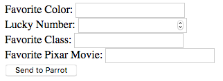

Styling Forms
=============

The forms we created in this chapter look pretty bland, since we stuck with
plain HTML. For example:

Visually, the form needs some work. First, the input fields don't line up
evenly. They don't have to, but aligning them makes our form look more
professional. Next, it would be nice to put some space between to boxes to keep
them from pushing right up against each other. Finally, the text is pretty
plain, and the button blends into the background.

Fortunately, we can fix this by applying some CSS style rules!

Add CSS
-------

Vanilla is a great ice cream flavor, but we can do better than *vanilla HTML*
when we make a form.

Visual tips:

#. Heading...
#. One field per line...
#. Alignment...
#. Space-filling...
#. Space on page...
#. Distinct border/shading to separate the form from other page content.
#. Other...

Use Bootstrap
-------------

Lorem ipsum...
