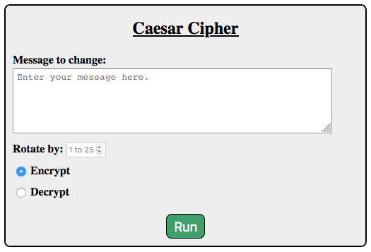

Project: Web Coded Messages (Part 1)
====================================

In this chapter, we coded several forms and used the *Parrot Server* to check
the data submitted. Of course, the parrot isn't a real server. It stores no
data, and it performs no actions other than sending back the key/value pairs it
receives in an HTTP request. It behaves like an electronic mirror.

In the next few chapters, we will learn how to run a *local* server on our
computer. This will allow us to receive form data, *do something* with it,
and then send back a carefully crafted response. By doing this, we can create
truly interactive webpages and websites.

With this in mind, we are going to split this project across two chapters. In
Part 1 (this chapter), you will create a form and verify that it submits its
data correctly. In Part 2 (next chapter), you will write Python code to collect
the data and act on it.

Introduction
------------

In :ref:`Assignment #2 <coded-messages>`, you wrote a Python program that takes
a string and *encrypts* it to create a coded message. The program also changes
a coded message back into plain text.

Your old program ran in the console. In this project, you will adapt the
program to run in a browser. To do this, you will need to create a form with
inputs for the original message, the size of the character shift, and whether
to encrypt or decrypt the message.

   One possible form style.

You will deal with the Python code later. For now, your job is to build a nice
looking form.

Getting Started
---------------

#. Launch Visual Studio Code and open your ``forms_chapter`` folder.
#. Save and commit any recent work in the repository.
#. From ``main``, checkout a new branch called ``web-caesar``.
#. In the *File Explorer* panel, use the buttons to create a new folder. Call
   it ``project``.
#. Inside ``project`` create empty ``.html`` and ``.css`` files. Be sure to
   give the files descriptive names.
#. In the empty HTML file, type ``html:5`` and hit *Enter*. Whoa! Instant
   starter code appears!

   .. figure:: figures/boilerplate-html.gif
      :alt: Typing html:5 in VS Code automatically adds boilerplate HTML.

      OK, that's really cool.

#. Change the text in the ``title`` element, then add a ``<link>`` to your
   project's CSS file.
#. Save and commit your work.

.. admonition:: Tip

   You will be working on this project over multiple chapters, and possibly
   from different locations or devices. It would be a good idea to add a
   :ref:`remote repository <git-project>` on GitHub to help track your work.

Create the Message Input
------------------------

#. Create a new ``form`` element in your HTML file. For now, assign the URL for
   the parrot server to ``action``.

   .. sourcecode:: html

      <form action="https://handlers.education.launchcode.org/request-parrot" method="POST">

#. Add a heading inside the form.
#. Add a ``textarea`` element where the user will enter their original message.
   Be sure to give this input a ``label``.
#. Add a *Submit* button to the form. However, label it something more clever
   than *Submit*.
#. Save your code, then open the ``.html`` file in your browser. Test your form
   to make sure that it works.

   .. figure:: figures/boilerplate-html.gif
      :alt: Typing html:5 in VS Code automatically adds boilerplate HTML.

      OK, that's really cool.

#. Commit your work to the repo before moving to the next section.

Add Number and Radio Inputs
---------------------------

Lorem ipsum...

Style the Form
--------------

Lorem ipsum...

Coming Up Next
--------------

In Part 2 of this project, you will write some Python code that will collect
the form data, use it to select the proper search engine, and then run the
search request with that engine.
