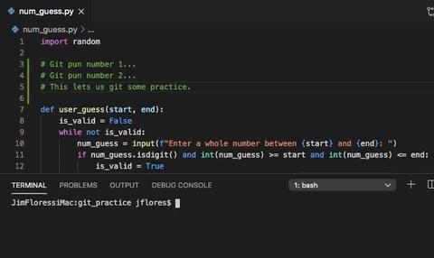
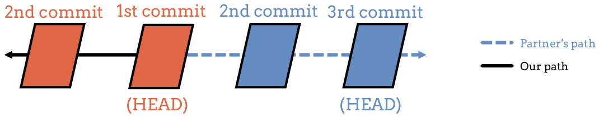

Navigating Commits
==================

After adding a series of commits to a Git repository, we can navigate through
them. If necessary, we can also restore an older version of our code.

Let's add one more commit to the ``git_practice`` repo. Then we will learn how
to move through its history.

Commit to ``num_guess.py`` Again
--------------------------------

#. Add some more statements to your code in ``num_guess.py``. You don't need
   anything fancy. Any simple, working program that is different from what you
   committed before will work.

   Feel free to use the LCHS code `here <https://repl.it/@launchcode/Simple-number-guessing-game#main.py>`__.
#. Use ``git status``, ``git add .``, and ``git commit -m`` to save a new
   commit to the repository.

You should now have at least three total commits in the repo.

Commit Log
----------

In the terminal, enter the command ``git log`` and examine the output. The
command displays a record of every commit in the repository. The top entry is
the most recent.

.. _git-log-example:

.. admonition:: Example

   The log for the three entries in the ``git_practice`` repo will look
   something like this:

   ::

      $ git log
      commit 39ab2d77c7813c67958e996961ddbca7a32b6762 (HEAD -> master)
      Author: I. M. Great <student@schoolname.edu>
      Date:   Mon Oct 26 15:46:41 2020 -0500

         Pasted in code from the LCHS number guessing repl.

      commit 479b8b3d84d485cff213015dfcf45b04ef7ea783
      Author: I. M. Great <student@schoolname.edu>
      Date:   Mon Oct 26 14:35:00 2020 -0500

         Added random number selection code.

      commit e14be18ae18e47084fca7d97f25474762b7e8a40
      Author: I. M. Great <student@schoolname.edu>
      Date:   Mon Oct 26 14:23:17 2020 -0500

         My first commit.

.. admonition:: Tip

   If the output reaches the bottom of the terminal pane before finishing, tap
   the space bar to display the next section of text. To stop the output and
   return to the command prompt, tap ``q``.

Each entry in the log contains four items:

#. ``commit`` shows a 40-character long code. This provides the key that Git
   uses to organize the commits in the repository.
#. ``Author`` indicates who made the commit. This becomes important when
   multiple coders work on the same project.
#. ``Date`` indicates the day and time the commit was made.
#. The indented line shows the comment saved with the commit. The more details
   we include in each comment, the easier it is to look through the log and
   know what changes were made between saves.

Undo Changes Since Last Commit
------------------------------

New code usually doesn't work perfectly on the first try. This is especially
true as our programs get larger.

One big advantage of version control is that it allows us to save working code
before we add and test a new feature. If the feature works, great! If not, we
tinker with it until it does. However, sometimes we will just create a complete
mess. When this happens, we need to step back, take a break, and then rethink
how to make the feature work.

Since we made a commit just before adding the new code, we can *restore* our
most recent version. This wipes away all of the changes made since that commit.
We can then start with our old, working code and try something different.

Let's see how this works.

.. admonition:: Try It!

   Restoring your most recent commit acts like a great big *Undo*.

   #. Add a few comment lines after the ``import`` statement in
      ``num_guess.py``. It doesn't matter what you type, as long as you make
      an obvious change.

      .. sourcecode:: python
         :linenos:

         import random

         # Git pun number 1...
         # Git pun number 2...
         # This lets us git some practice.

   #. Save your work in VS Code, but do NOT commit it.
   #. Use ``git status`` to verify that you have uncommitted changes in the
      file.

      ::

         $ git status
         On branch master
         Changes not staged for commit:
         (use "git add <file>..." to update what will be committed)
         (use "git checkout -- <file>..." to discard changes in working directory)

               modified:   num_guess.py

         no changes added to commit (use "git add" and/or "git commit -a")

   #. Now enter the following command in the terminal. Pay close attention to
      what happens to the comments you added in ``num_guess.py``.

      ::

        $ git reset --hard HEAD
   
   Whoa, the added statements disappear!

**Syntax review**:

#. ``git reset`` moves us backwards through the commit history.
#. ``HEAD`` identifies the commit to move to. Looking at the output from the
   :ref:`git log example <git-log-example>`, we see that the first entry is
   labeled with ``(HEAD -> master)``. Think of ``HEAD`` like a bookmark in the
   log.
#. ``--hard`` removes all changes made after the ``HEAD`` commit.

Switching Between Commits
-------------------------

What if we want to move further back in the commit history? This is possible.
Git allows us to move the ``HEAD`` bookmark to any commit in the log. We can
then ``reset`` to that state of the code and move forward from there.

However, this is not the best option. In fact, doing this is actively
discouraged in the coding community. Consider this example:

.. admonition:: Example

   Imagine that we move ``HEAD`` from the most recent commit back to the very
   first one we made.

   .. figure:: figures/move-head.png
      :alt: Move the HEAD bookmark back to the earliest commit in the log.
      :width: 60%

   What happens to the second and third commits we saved to the repository?

In our local version of the repo, the second and third commits would be wiped
out if we use ``--hard`` in our reset command. It's the nuclear option.

This might not sound like a problem, but it is if other coders are working on
our project. Their logs will now be different, since they are still working off
of the old commits. This causes problems when it comes time to merge everyone's
work together. By moving ``HEAD`` back to the beginning on our machine, we
created a separate path for the project:

Resetting to anything but the most recent commit complicates the history for
the repository.

Fortunately, Git provides a way for us to preserve the work flow history and
let us experiment with new features and code.
