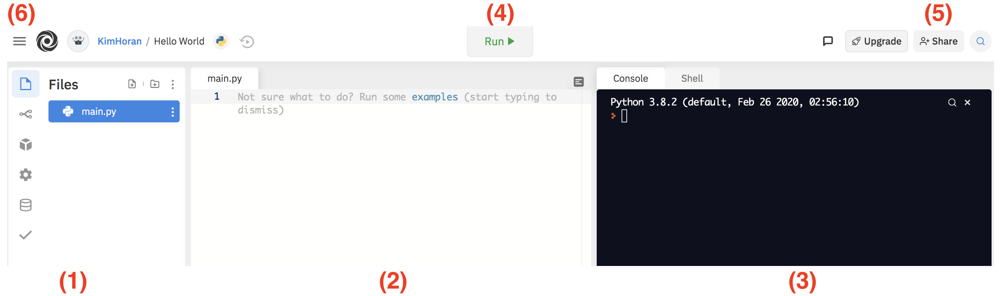

Repl.it
=======

`Repl.it <https://repl.it>`__ and `Trinket.io <https://trinket.io>`__ share
many of the same features, but the two sites differ in how they present their
workspaces.

The previous page explored Trinket, so now let's take a look at Repl.it.

Create a Repl.it Account
-------------------------

.. admonition:: Warning

   Before signing up for a repl.it account, be sure your school has approved
   the site for student use!

Create a new student account with `Repl.it <https://repl.it/signup>`__.

After you sign in, you will see your *Home* screen, which displays your recent
work and announcements. Since you are just starting out, you won't need to do
much on this screen.

.. figure:: figures/replit-home.png
   :alt: Repl.it home screen.

   Home screen

Click on *new repl* to begin a new project. Scroll through the options and
select *Python*. Next, name your project and click *Create Repl*.

.. figure:: figures/replit-newrepl.png
   :alt: Create a new Python repl.

The Repl.it Workspace
---------------------

Now let's take a look at how to use Repl.it. The workspace consists of three
main panels and several menu functions.

Features to note:

#. **File panel and menus**: Allows you to add extensions, update settings, and
   add, open, or delete files.
#. **Editor panel**: Your code goes here. Click on a file to open it in the
   editor. For most new projects, a ``main.py`` file will be created and opened
   by default.
#. **Console panel**: Any output produced by your code will appear in this
   panel. The console also displays error messages, test results, and other
   information.
#. **Fork button**: If you are viewing someone else's project, you can *fork*
   the content and store a copy of that project to your own account. This
   allows you to edit the files without changing the originals, and it lets
   you use other programmers' work (with permission) to enhance your own.
#. **Run button**: Executes any code written in the ``main.py`` file.
#. **Managing projects**: When logged into Repl.it, you can create a new
   project, view saved projects, or share your projects.

.. admonition:: Note

   The workspace shown above uses the "dark" theme (light text on a black
   background). If you prefer the reverse (dark text on a white background),
   click the gear icon and select the "light" theme.

Try It!
-------

Repeat your ``Hello, World!`` program in the editor. Repl.it automatically
saves your work, so your changes should not be lost when you logout or
refresh the page.

At any time, you can return to a list of your saved projects by clicking on the
menu bars next to your username and selecting *My Repls*.

.. figure:: figures/replit-menu-dropdown.png
   :alt: Main menu dropdown options.
