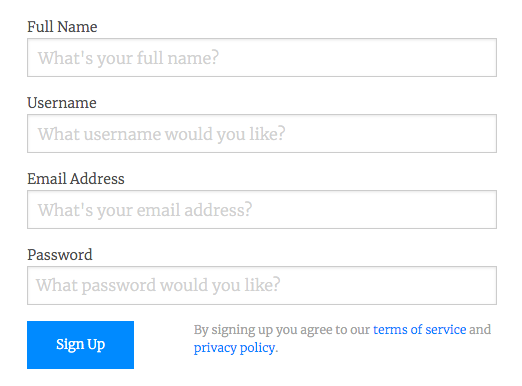
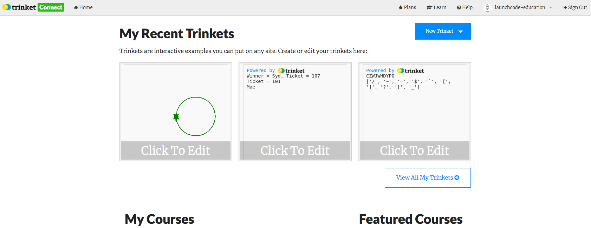
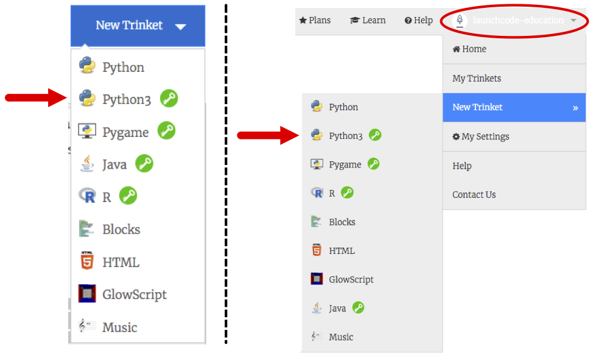
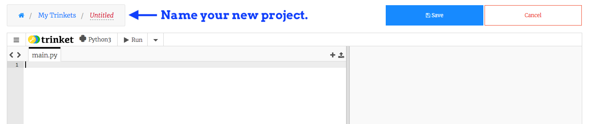
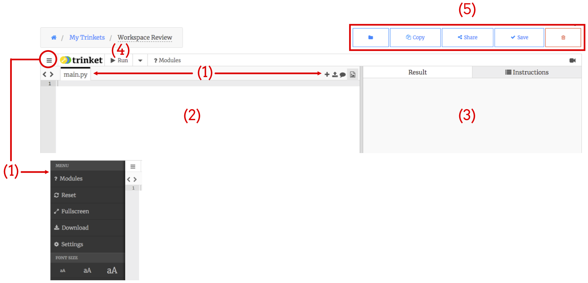

Trinket.io
==========

`Repl.it <https://repl.it>`__ and `Trinket.io <https://trinket.io>`__ are free
online code editors, and they both provide a practice space to boost your
programming skills.

For this class, the sites serve two purposes:

#. To provide a space to practice quick tasks and examples found in the
   reading.
#. To hold larger exercises and projects that will be checked for accuracy and
   tracked for completion.

Create a Trinket.io Account
---------------------------

.. admonition:: Warning

   Before signing up for a Trinket account be sure your school has approved
   the site for student use!

Create a new student account with Trinket `here <https://trinket.io/signup>`__.

After you sign in, you will see your *Home* screen, which displays your recent
work and course options. Since you are just starting out, you won't need to do
much on this screen.

   Home screen

Click on the *New Trinket* button to begin a new project. You can also access
this option from the username dropdown menu. Scroll through the language
options and select *Python3*.

   New trinket options.

After you select the language, your new trinket opens! Click on *Untitled* to
name your project, then use the *Save* button.

   Name your new project!

The Trinket Workspace
^^^^^^^^^^^^^^^^^^^^^

Now let's take a look at how to use Trinket. The workspace consists of two
main panels, one hidden panel, and several menu functions.

Features to note:

#. **File tabs and options**: Allows you to select, add, upload, or delete
   files. Clicking on the 3 bars also reveals extra options, like *Settings*.
#. **Editor panel**: Your code goes here. Click on a tab to open it in the
   editor. For new Python projects, a ``main.py`` file will be created and
   opened by default.
#. **Console panel**: Any output produced by your code will appear in this
   panel. The console also displays error messages, test results, and other
   information. Also, by clicking on the *Instructions* tab, you can include
   steps for other users to follow.
#. **Run button**: Executes any code written in the ``main.py`` file.
#. **Managing projects**: From left-to-right, the buttons allow you to:

   a. Move your project into a folder, 
   b. Copy a project, which allows you to edit the code without changing the
      original,
   c. Share your projects with other users,
   d. Save changes to the project,
   e. Delete the project completely.

If you are viewing someone else's project, you will also see a *Remix* button.
Clicking *Remix* saves a copy of that project to your own account. This lets
you use other programmers' work (with permission) to enhance your own.

Try It!
-------

Repeat your ``Hello, World!`` program in the editor. Be sure to save your work!
If you forget to click *Save*, you will lose the new changes when you logout or
refresh the page.

At any time, you can return to a list of your saved projects by clicking on the
*My Trinkets* link next to the project name.

Trinket Python Versions
-----------------------

Lorem ipsum...
