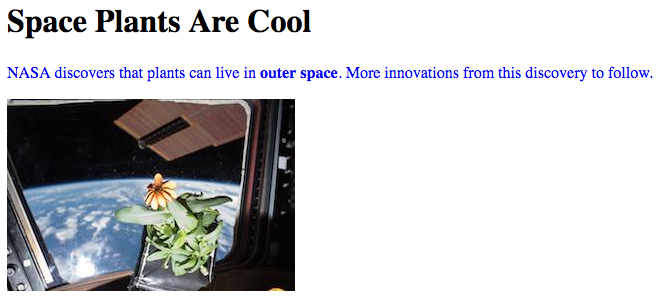

.. _html-tags:

HTML Tags
=========

Time to dive into all the different tags for organizing content! This page
contains a helpful table of tags for beginning programmers. *Tip*: Bookmark
this page!

This is NOT a complete list of all HTML tags, but it is a good place to start.
If you are interested in exploring other tags on your own,
`W3Schools <https://www.w3schools.com/tags/>`__ provides a longer, interactive
list.

Tags to Know
------------

.. list-table::
   :widths: auto
   :header-rows: 1

   * - Tag Name
     - Code
     - Definition
   * - Bold
     - ``<b>``
     - When surrounding text, makes that text **bold**.
   * - Break
     - ``<br>``
     - A single line break.
   * - Button
     - ``<button>``
     - Creates a clickable button.
   * - Division
     - ``<div>``
     - Defines an area of the page. Often used as a container to arrange other elements.
   * - Emphasis
     - ``<em>``
     - When surrounding text, makes that text *italic*.
   * - Form
     - ``<form>``
     - Creates a form for user input.
   * - Heading, Level One
     - ``<h1>``
     - Creates a heading in the text.
   * - Hyperlink
     - ``<a>``
     - Creates clickable links to other web pages.
   * - Image
     - ````
     - Adds an image and controls its appearance.
   * - List element
     - ``<li>``
     - Indicates an element of a list. This tag is used for both ordered and unordered lists.
   * - Ordered List
     - ``<ol>``
     - Creates an ordered list. List items are given numbers, letters, etc. from top to bottom.
       
       .. list-table::
          :widths: auto

          * - .. raw:: html

                 <ol>
                   <li>First list item</li>
                   <li>Second list item</li> 
                   <li>Third list item</li> 
                 </ol>
            - .. raw:: html

                 <ol type="A">
                   <li>First list item</li>
                   <li>Second list item</li> 
                   <li>Third list item</li> 
                 </ol>
            - .. raw:: html

                 <ol type="I">
                   <li>First list item</li>
                   <li>Second list item</li> 
                   <li>Third list item</li> 
                 </ol>
   * - Paragraph
     - ``<p>``
     - Creates a paragraph of text.
   * - Section
     - ``<span>``
     - Makes a section within a set of text.
   * - Table
     - ``<table>``
     - Creates a table on the page.
   * - Thematic Break
     - ``<hr>``
     - Adds a horizontal line between elements.
   * - Unordered List
     - ``<ul>``
     - Creates an unordered list with bullet points for each item.

       .. raw:: html

          <ul>
            <li>First list item</li>
            <li>Second list item</li> 
            <li>Third list item</li> 
          </ul>

.. admonition:: Note

   There are multiple headings in HTML going from ``h1`` to ``h6``.
   The headings get progressively smaller.
   A good rule of thumb is to have only one ``h1`` in a web page and do not skip a level.
   Headings can be resized so there is no need to do so.

Tag Example
-----------

Here is an example of a basic web page using some of the tags above.

.. sourcecode:: html
   :linenos:

   <!DOCTYPE html>
   <html>
      <head>
         <title>Plant-Loving Astronauts</title>
      </head>
      <body>
         <h1>Space Plants Are Cool</h1>
         <p>
            NASA discovers that plants can live in <b>outer space</b>.
            More innovations from this discovery to follow.
         </p>
         <!-- add images from NASA of these space plants -->
      </body>
    </html>


Inside the ``body`` element, the ``<h1>`` and ``<p>`` tags define a heading
and a paragraph element. Note that the ``p`` element also contains a set of
``<b>`` tags, which make the words "outer space" bold.

Attributes
----------

.. index:: ! attribute

In addition to the tag name, programmers can include extra information inside
an HTML start tag. Programmers add **attributes** to HTML tags to control and
adjust the element's appearance on the page.

Examples of attributes include:

#. The alignment of the element on the page (left, right, centered, etc.).
#. The text style (color, size, font, etc.).
#. Alternate text for an image.
#. The web address that a link points to.

Programmers place attributes inside the start tag, right after the tag name.
The general syntax for this is:

.. sourcecode:: html

   <tag_name attribute="value">content</tag_name>

Attributes Example
------------------

Here is the same basic web page we saw above, but with a new ```` tag.
Also, the ``<p>`` and ```` tags both include some attributes.

.. sourcecode:: html
   :linenos:

   <!DOCTYPE html>
   <html>
      <head>
         <title>Plant-Loving Astronauts</title>
      </head>
      <body>
         <h1>Space Plants Are Cool</h1>
         <p style="color:blue">
            NASA discovers that plants can live in <b>outer space</b>.
            More innovations from this discovery to follow.
         </p>
         
         <!-- This image was taken by NASA and is in the Public Domain -->
      </body>
    </html>



The ``<p>`` tag includes the ``style`` attribute, and the value in quotes sets
the color of the text to blue. ``style`` controls other properties as well,
including alignment, font, background color, text size, etc. We will study
styling in more detail next chapter.

The ```` tag has two attributes that we will see a lot. ``src`` gives the
location of the image that is being used, and ``alt`` gives alternate text for
screen reader users. For that reason, ``alt`` should be a short description of
what is going on in the image.

Block vs. Inline Elements
-------------------------

.. index:: ! block-level, ! inline

Take another look at the screenshots for the basic web pages. Notice that the
sentence, ``NASA discovers that plants can live...`` is split over two lines in
the editor, but it appears on the same line on the web page. However, the
heading and paragraph elements appear on separate lines.

The reason behind this involves the default behavior for each HTML element.
There are two display behaviors:

#. **Block-level elements** always begin on a new line, and they take up the
   full width available. Any content in these elements stretches out as far as
   possible before wrapping to the next line.
#. **Inline elements** do not start on a new line. They only take up as much
   width as necessary.

The ``h1`` and ``p`` elements are both block-level. Their content occupies a
dedicated space on the screen. This is why the heading and paragraph do not
appear side-by-side.

The ``b`` element is inline. Its content occupies only as much space as
necessary. This allows it to be nested inside the ``p`` element without
breaking the paragraph into separate lines.

.. admonition:: Example

   By playing with the background colors, we can see the difference in behavior
   for block-level vs. inline elements.

   .. sourcecode:: html
      :lineno-start: 6

      <body>
         <h2 style="background:orange">Here Is A Heading Element</h2>
         <p style="background:lightblue">This is a paragraph element.</p>
         <span style="background:lightgreen">These are</span>
         <span>three separate</span>
         <span style="background:violet">span elements.</span>
      </body>

   .. figure:: figures/block-vs-inline.png
      :alt: Background colors showing the widths of block-level vs. inline elements. 

   The ``h2`` and ``p`` elements stretch across the entire width of the screen,
   and they occupy their own, separate lines. Each ``span`` element only takes
   up as much space as the text requires, and all three elements can share the
   same line.

.. admonition:: Tip

   Nest inline elements inside block-level elements, not the other way around!

Try It!
-------

In the editor below, practice using different HTML tags and attributes to
change the appearance of a web page.

.. todo:: Insert interactive HTML editor here (tag and attribute practice).

Instructions here...

#. ``br`` and ``hr`` elements...
#. ``a`` element...
#. ``div`` container, with alignment attribute...
#. ``ul`` with three ``li`` elements...
#. Change ``ul`` to ``ol``. Use the ``type``, ``reversed`` and ``start``
   attributes to change the list labels.

Check Your Understanding
------------------------

.. admonition:: Question

   Which tag is used to make text *italicized*?

   #. ``b``
   #. ``i``
   #. ``em``
   #. ``br``

.. admonition:: Question

   Identify each of the following as a block-level or inline element. Click
   each option to check your thinking. *Hint*: Use the editor to test each
   element!

   #. ``div``
   #. ``span``
   #. ``em``
   #. ``ol``
   #. ``ul``
   #. ``li``
   #. ``img``
   #. ``h1``
