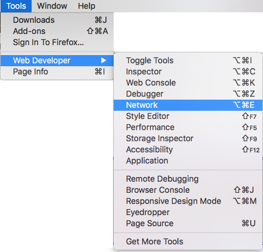

HTTP In The Browser
===================

While we looked at the HTTP concepts we need to know, we haven't actually
*seen* what this looks like in real time. Requests and responses take place
behind the scenes. To to view them, we need to open up a new tool.

Viewing Requests and Responses
------------------------------

Let's start with the simple webpage used for one of the CSS examples:

   A simple webpage for HTTP viewing.

The code for the page is in the editor below. For these examples, however, you
will need to open a couple of new tabs. Click the *Open in repl.it* button to
enter the full workspace. Next, click on the *Open in a new tab* button that
appears in the upper right corner of the output panel.

.. raw:: HTML

   <iframe height="500px" width="100%" src="https://repl.it/@launchcode/HTTP-sample-page?lite=true" scrolling="no" frameborder="yes" allowtransparency="true" allowfullscreen="true" sandbox="allow-forms allow-pointer-lock allow-popups allow-same-origin allow-scripts allow-modals"></iframe>

In the new tab (titled ``HTTP in the browser``), you should see the sample
webpage. Now let's take a look at the requests and responses that occur when
displaying the page.

Try It!
^^^^^^^

.. admonition:: Note

   The images below were taken from Firefox. Other browsers will show similar
   results, but slight differences should be expected.

Make sure you are in the ``HTTP in the browser`` tab, then do the following:

#. Open your browser's developer tools and select the *Network* tab.

   a. *Method 1*: Firefox has a *Tools* menu. Select *Web Developer* and
      *Network* from the options.

      .. figure:: figures/open-dev-tools.png
         :alt: Use the menu to open Firefox's developer tools (Network option).
         :height: 300 px
      
   b. *Method 2*: Right click inside the page and select *Inspect Element*. In
      the panel that opens, click the *Network* tab.

      .. figure:: figures/open-dev-alt.png
         :alt: Right click on a page to open the developer tools (Inspect option).

#. The *Network* pane displays all the HTTP requests and responses that occur
   when loading a page. However, it only works if it is open during the
   request. To see some data appear in this panel, refresh the page.
#. Now you'll see something like this:

   .. figure:: figures/network-tab.png
      :alt: Firefox's developer tools, with several requests in the Network pane.

      The Network panel, showing four requests/responses.

#. Each entry gives information about a single HTTP request. The entries appear
   in the order in which the requests are made as the page loads.
#. Note the response codes that appear on the left side of each entry. Hovering
   over one of these provides some status information about the request.
#. Click on one of the ``200`` entries. This opens up more details about the
   request and the response.

   .. figure:: figures/network-tab-details.png
      :alt: The details of an HTTP request, viewed in the Network pane.

   On the right, we can find the response headers and (scrolling down) the
   request headers. We can even view the response body by clicking on the
   *Response* label.

Browser Flow
------------

Looking in the *Network* pane, we see that loading this simple web page
involves *several* HTTP requests. Each resource within the page (like the image
of the space flower) requires a separate request.

Let's examine the flow of loading this page, which used a ``GET`` request.

#. The browser requests the page from the server.
#. The browser receives the HTML page and executes its code.
#. For the external CSS file and the image, the browser issues a *new* HTTP
   request for the given file.
#. As each new response is received, the browser processes the data or media
   and updates the page. 

This flow explains why we sometimes load a web page and see the content update
over a few seconds (or longer). In these cases, the HTTP requests for larger
data files (like high-resolution images) take more time to complete.

.. admonition:: Try It!

   Navigate to a different page with the *Network* pane open. Find the
   response code and ``Content-Type`` header for the first request shown in the
   pane.

Check Your Understanding
------------------------

.. admonition:: Question

   For the first screenshot on this page, answer these questions:

   #. What is its file name?
   #. How large is it?   

