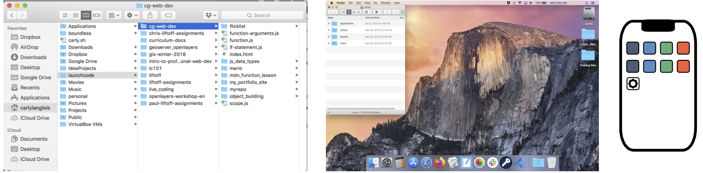

What is a Terminal?
===================

GUIs and CLIs
-------------

Most of the time when we use our computers and smartphones, we do so through a 
**graphical user interface**, or **GUI** for short. A GUI is a system designed
to use icons and visual tools to manage tasks. Creating a new folder, running
programs, and moving or deleting files are all done by selecting menu items or
clicking icons on the screen.

   A GUI with file icons and columns representing folder structure.

.. todo:: Update GUI figure to include a desktop view and phone home screen.

Programmers often use another kind of interface, called the **command line**. A 
**CLI**, or command line interface, uses text to give the computer instructions
instead of dragging and dropping icons. 

.. figure:: figures/CLI-example.png
   :alt: Sample command line interface.

   A CLI with commands navigating the same file paths as the GUI above.

The application responsible for running a CLI is called a **terminal**, and the 
program interpreting the commands is called the **shell**.

.. admonition:: Note

   The terms *command line*, *terminal*, and *shell* are often used
   interchangeably.

Why Use the Terminal?
---------------------

Both of the images above represent the same file structure. While the GUI may now 
appear more user-friendly, as you grow more familiar with the commands available,
you'll find there can be advantages to using the terminal. 

In the terminal, you will be able to:

- quickly move throughout your computer's file structure 
- make new files and directories 
- remove items from folders 
- install software
- open programs 
- run programs directly

Setup the Terminal
------------------

Follow these instructions for setting up your terminal.
You'll need it for this chapter's exercises and you can explore inside it while 
you read along with the text.

.. todo:: Add internal link to Terminal setup instructions.
