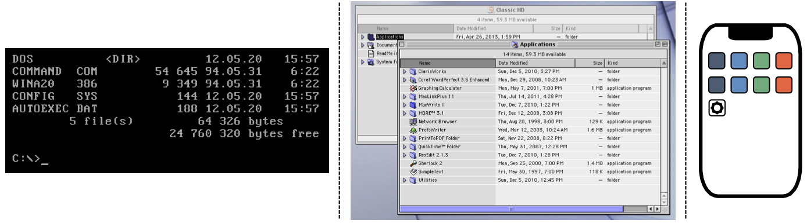

The User Experience
===================

.. index:: ! UI, ! UX

The term **user interface** (UI) refers to the buttons, windows, icons, etc.
that a human interacts with when they use a device.

   Three UI examples: a command line prompt, a clickable file tree, and a touch-sensitive home screen.

**User experience** (UX) refers to the emotions a person feels as they interact
with an application or device. The better the experience, the more likely they
are to keep using it.

   https://www.thefarside.com/

Good developers pay close attention to both UI and UX. Often, the two ideas go
hand in hand. However, they are NOT the same thing. For example, here's a
relatively simple user interface:

.. figure:: figures/simple-ui.jpg
   :alt: Image of a roll of toilet paper on a holder.
   :width: 40%

   The UI controls how the user interacts with the device.

This design is efficient, easy to understand, and effective. Now, take that
same UI and apply it in two slightly different ways. This gets us to the user
experience. Can you identify which setup provides the better UX?

.. figure:: figures/compare-ux.png
   :alt: Image of a roll of toilet paper in and out of reach.
   :width: 80%

   UX deals with how the user feels when interacting with the device.

Flask gives us the tools to make a decent UI, like the page navigation menu we
created on the previous page. However, a solid UI doesn't guarantee a good UX.
For example, the navigation menu appears below any HTML inserted into the base
template. Since each page has a different amount of content, the location of
the menu changes after we click a link. This provides a poor UX.

.. admonition:: Try It!

   What steps can we take to improve the users' experience with the navigation
   menu? Try out a few ideas, then demo them for your teacher and/or
   classmates.

Explore UX
----------

A poor interface often leads directly to a bad user experience.

   Three examples of a poor user interface.

On the other hand, a good UI may lead to an excellent, average, or poor UX. For
example, the `Netflix <https://www.netflix.com/>`__ streaming service includes
an autoplay feature. When users hover over a title in a list of movies, after a
moment a trailer starts to play. Some users like this feature, but others find
it incredibly annoying. Users who *just want to read the description* of the
movie find the preview distracting, especially if they want to avoid making
noise in school or at work.

.. admonition:: Try It!

   Follow each of the links below, and try to complete the task described.
   As you explore, evaluate your own user experience. Consider:
   
   - Does the user interface work? Is it easy to use?
   - Was the design of the webpage appealing?
   - Were you able to complete the task? How long did it take?
   - Would you use the website again, or would you look for a different option?
   - What features on the website did you like? Did anything annoy you?

   **Links**:

   #. `IRS website <https://www.irs.gov/>`__: After buying an electric car,
      some owners can claim a tax credit. Find the form required to claim this
      credit (PDF format).
   #. Recipe (good site and bad site) - Find ingredients and steps required to
      bake each of these cakes!
   #. Wikipedia - find the date of the last manned moon landing
      (https://en.wikipedia.org/wiki/Main_Page)...

Other Reading
-------------

For those interested in a deeper look at UI and UX, here are two articles and
a video to get you started.

#. `What are the Similarities & Differences Between UI Design & UX Design? <https://xd.adobe.com/ideas/process/ui-design/ui-vs-ux-design-understanding-similarities-and-differences/>`__
#. `UI, UX: Who Does What? A Designer’s Guide To The Tech Industry <https://www.fastcompany.com/3032719/ui-ux-who-does-what-a-designers-guide-to-the-tech-industry>`__
#. `How Much Code Should A UX Designer Write? <https://www.youtube.com/watch?v=BRWh7Nc0lbk&feature=emb_logo>`__

Check Your Understanding
------------------------

Lorem ipsum...
