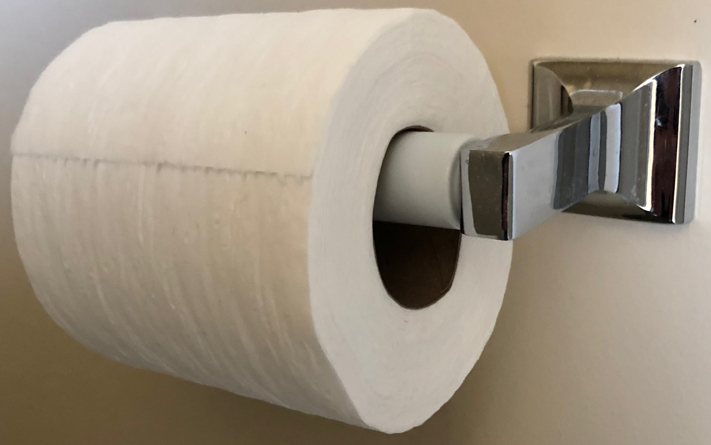

The User Experience
===================

.. index:: ! UI, ! UX

The term **user interface** (UI) refers to the buttons, windows, icons, etc.
that a human interacts with when they use a device.

.. figure:: figures/ui-ux.png
   :alt: Three different user interfaces: a CLI, a GUI, and a smartphone home screen.
   :width: 80%

   Three UI examples: a command line prompt, a clickable file tree, and a touch-sensitive home screen.

**User experience** (UX) refers to the emotions a person feels as they interact
with an application or device. The better the experience, the more likely they
are to keep using it.

.. figure:: figures/inconvenience-store.jpg
   :alt: A Far Side cartoon showing an "inconvenience store".
   :width: 40%

   https://www.thefarside.com/

Good developers pay close attention to both UI and UX. Often, the two ideas go
hand in hand. However, they are NOT the same thing. For example, here's a
relatively simple user interface:

   The UI controls how the user interacts with the device.

This design is efficient, easy to understand, and effective. Now, take that
same UI and apply it in two slightly different ways. This gets us to the user
experience. Can you identify which setup provides the better UX?

.. figure:: figures/compare-ux.png
   :alt: Image of a roll of toilet paper in and out of reach.
   :width: 80%

   UX deals with how the user feels about using the device.

Flask gives us the tools to make a decent UI, like the page navigation menu we
created on the previous page. However, a solid UI doesn't guarantee a good UX.
For example, the navigation menu appears below any HTML inserted into the base
template. Since each page has a different amount of content, the location of
the menu changes after we click a link. This provides a poor UX.

.. admonition:: Try It!

   What steps can we take to improve the users' experience with the navigation
   menu? Try out a few ideas, then demo them for your teacher and/or
   classmates.

A poor user interface often leads directly to a bad user experience. However, a
good UI may lead to an excellent, good, average, or poor UX.

Other Reading
-------------

For those interested in a deeper look at UI and UX, here are two articles and
a video to get you started.

#. `What are the Similarities & Differences Between UI Design & UX Design? <https://xd.adobe.com/ideas/process/ui-design/ui-vs-ux-design-understanding-similarities-and-differences/>`__
#. `UI, UX: Who Does What? A Designer’s Guide To The Tech Industry <https://www.fastcompany.com/3032719/ui-ux-who-does-what-a-designers-guide-to-the-tech-industry>`__
#. `How Much Code Should A UX Designer Write? <https://www.youtube.com/watch?v=BRWh7Nc0lbk&feature=emb_logo>`__

Check Your Understanding
------------------------

Each of the following images gives an example of a poor UX. However, the UI
might be just fine. Study each picture and decide if the UX problem comes from
a poor user interface, or a faulty implementation of a good interface.

.. list-table::

   * - .. figure:: figures/door-pull.jpg
          :alt: Door pull
     - .. figure:: figures/stairs-2.jpg
          :alt: Stairs 2
     - .. figure:: figures/train-tracks-2.jpg
          :alt: Train tracks 2
   * - This is an example of:

       #. a poor user interface.
       #. a bad use of a working UI.
     - Figure 2
     - Figure 3
   * - .. figure:: figures/br-ux-1.png
          :alt: Bathroom 1
     - [IMAGE HERE]
     - .. figure:: figures/train-tracks-1.jpg
          :alt: Train tracks 1
   * - Figure 4
     - Figure 5
     - Figure 6

.. list-table::

   * - .. figure:: figures/door-pull.jpg
          :alt: Door pull
          :width: 80%
     - This is an example of:

       #. a poor user interface.
       #. a bad use of a working UI.
   * - .. figure:: figures/stairs.jpg
          :alt: Stairs
          :width: 80%
     - Figure 2
   * - .. figure:: figures/train-tracks-2.jpg
          :alt: Train tracks 2
          :width: 80%
     - Figure 3
   * - .. figure:: figures/br-ux-1.png
          :alt: Bathroom 1
          :width: 80%
     - Figure 4
   * - [IMAGE HERE]
     - Figure 5
   * - .. figure:: figures/train-tracks-1.jpg
          :alt: Train tracks 1
     - Figure 6
