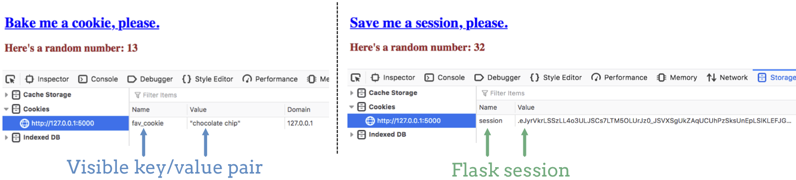

Flask Sessions
==============

Cookies provide a useful way to store data for longer periods of time. However,
we must never forget one critical fact:

   Cookie data is not secure.

As we saw on the previous page, the browser tools allow users to view any
cookies stored on their devices. Not only can users access the cookies, they
can also easily modify them.

For example, let's say we create a Flask application to manage an online store.
If we use a cookie to save the total cost of an order, a dishonest customer
could edit the file and change their bill from ``$125.47`` to ``$1.50``.
Similarly, if a different cookie tracks store credit, the user could easily
bump their total from ``$10.00`` to ``$10,000.00``.

For security, we should *never* use cookies to store sensitive data.

Our next step is to add some more security to the persistent data we save. This
still won't protect information like passwords, but it gets us a little closer
to where we want to go.

What are Sessions?
------------------

.. index:: ! session

.. index::
   single: Flask; session

A Flask **session** uses cookies to store data on a user's device. However,
unlike plain cookies, a session restricts who can change the file. A *session
cookie* still gets saved to a user's device, but they cannot modify it without
permission.

When we create session cookies, we must include a secret key in our code. This
adds some encryption to the data stored on the user's machine. When the browser
sends a set of cookies back to the server, Flask tries to decode each one with
the same key. If the key is missing or incorrect, the data is ignored.

Without knowing the secret key, it becomes harder (but not impossible) for
outside users to access or change the saved data.

Cookies vs. Sessions
^^^^^^^^^^^^^^^^^^^^

Cookies and sessions are very similar, but not quite the same thing. Think of
sessions as cookies with extra features.

The easiest way to spot a difference is to view cookies and sessions in the
browser tools. Let's compare two cases. In the first example, we visit a
website that sets a single key/value pair.

   The key/value pair for a normal cookie is clearly visible. The session data is encrypted.

The website on the left side of the figure sets a regular cookie. Note that we
can clearly see both the key and its value. Modifying either of these would be
a snap. The right hand side comes from a website that uses a session. Notice
that the key is no longer listed under the ``Name`` column. Also, the ``Value``
displayed has been encrypted. It does not appear as readable text.

In the next example, the two websites set multiple key/value pairs.

.. figure:: figures/cookie-vs-session-2.png
   :alt: Showing cookie and session information after multiple key/value pairs are set.

   Multiple key/value pairs are stored in the same session.

Note that on the left, we can see exactly how many cookies have been set. We
can also clearly read all of the key/value pairs. On the right, the session
saves the same amount of data, but it appears as a *single* item.

Set Up Flask Sessions
---------------------

To work with sessions in our Flask programs:

#. Import the ``session`` object from the ``flask`` library.
#. Set up a secret key to encrypt the session cookies.

The general syntax for this is:

.. sourcecode:: python
   :linenos:

   from flask import Flask, request, redirect, render_template, session
   
   app = Flask(__name__)
   app.config['DEBUG'] = True
   app.secret_key = 'This_is_NOT_a_good_secret_key!'

On line 1, ``session`` replaces ``make_response``. On line 5, we assign a
string value as the ``secret_key``. The more complicated we make this string,
the harder it will be for outsiders to decrypt the data.

With these two updates to our code, we are ready to start working with session
cookies. We'll practice this on the next page. First, however, we
need to learn how to set a good secret key.

.. admonition:: Warning

   Using sessions does provide more safety than plain cookies, but sessions are
   NOT secure. The data is still stored on a user's machine, which means they
   have direct access to the file.

   While it is harder to view the key/value pairs, decoding the data from a
   session is a fairly straightforward process.

Strong Secret Keys
------------------

Just like with passwords, we want our ``secret_key`` to be as complicated as
possible. However, even if we think of a great key to use, typing it directly
into our code presents problems.

Imagine we used this for our secret key:

.. sourcecode:: python
   :lineno-start: 5

   app.secret_key = 'K>~EEAnH_x,Z{q.43;NmyQiNz1^Yr7'

This seems pretty hard to guess! However, we typed it directly into our Python
code. If we share our program with others, then we've just given away the key.
Anyone who opens the ``.py`` file will see the string we used.

Also, if we push our program up to GitHub, then we save our code in the cloud.
*Anyone* who visits the URL for the repository can see the value assigned to
``secret_key``.

To help keep the value for ``secret_key`` safe, it would be better to avoid
hard-coding it into our program. A Google search turns up many options, but
here's one approach that we can use for now.

Lorem ipsum...

Check Your Understanding
------------------------

Lorem ipsum...
