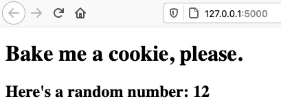

Flask Cookies
=============

When a server creates a cookie on our browser, it sets a specific time for that
data to last. If no time is set, then the cookie gets erased when we quit the
browser. Putting our device to sleep or closing the tab does NOT clear cookies!

Recall that Flask runs a server on our machine when we launch an application.
This means we can include some Python code to set and access our own cookies.

Let's see how to do this.

Cookie Video
------------

Watch this short clip to explore the Python code for setting a cookie.

.. todo:: Insert video of setting cookies in Flask.

Points to note:

#. make_response in import statement
#. make_response() builds an HTTP response to send back from the server. The
   argument can be a simple string like "Hello, World!", or it can be the
   result generated by the ``render_template()`` function.
#. Before, we sent HTTP responses with render_template() only. make_response()
   lets us do more detailed work.
#. set_cookie() syntax and meaning.
#. More detailed set_cookie() discussion at this URL... (insert link)

Viewing Cookies
---------------

As shown in the video, we can use our browser tools to view the cookies saved
for a particular webpage. The specific commands will vary with each browser,
but right-clicking on the webpage is a good thing to try first. Select
*Inspect Element* from the options that pop up, and then open the *Storage*
tab.

[Screenshot of cookie panel]

Note that the cookie data was NOT sent to the webpage as a value. Adding a
{{favorite_cookie}} placeholder to the template results in an unfilled space.
However, the storage panel shows that the cookie file was saved.

Even if we stop the Flask application, the cookie persists in the browser.

[Disconnected screenshot]

When we change the name of the cookie in our Python code and restart the
program, the old cookie file remains. When we load the page again, a new cookie
file is saved.

[Screenshot of updated cookie pane]

Accessing Cookie Data
---------------------

Lorem ipsum...

Reference Repository
--------------------

GitHub link...

Set a Cookie
------------

Go ahead and launch ``main.py``, then open the application in a new browser
tab. The program renders the ``index.html`` template, which displays a short
message in addition to a random number.

   Refreshing the page will change the number displayed.

The program also sets a cookie, but we won't see that on the screen. Let's walk
through the code in ``main.py`` to see what's going on.

Resources
---------

https://overiq.com/flask-101/cookies-in-flask/

https://pythonise.com/series/learning-flask/flask-cookies
